# Fullstack MERN Foodstore

> [🇬🇧 English](README.md) · 🇮🇩 Bahasa Indonesia

Aplikasi e-commerce makanan lengkap yang dibangun dengan MERN Stack (MongoDB, Express, React, Node.js). Pengguna dapat menjelajahi produk makanan, menambahkan ke keranjang, checkout dengan alamat pengiriman, membayar via Midtrans, melacak status pesanan secara real-time via Pusher, mengonfirmasi penerimaan barang, memberi rating produk yang dibeli, serta menyimpan favorit ke wishlist. Autentikasi mendukung email/password dengan verifikasi email dan Google OAuth. Admin dapat mengelola produk, kategori, dan pesanan, serta memantau dashboard live dengan grafik pendapatan, peringatan stok menipis, dan ekspor Excel. Dilengkapi REST API siap-mobile termasuk endpoint Google Sign-In mobile dan Expo push notification untuk update status pesanan real-time (React Native / Flutter).

---

## Struktur Proyek

```
fullstack-mern-foodstore/
├── foodstore-server/   # Backend  — Node.js + Express + MongoDB
└── foodstore-web/      # Frontend — React + Redux
```

---

### Backend (`foodstore-server/`)

```
app/
├── auth/               # Register, login, logout, me, Google OAuth
├── cart/               # Keranjang belanja (GET + PUT — strategi replace)
├── cart-item/          # Model CartItem
├── category/           # Kategori produk (CRUD)
├── dashboard/          # Statistik admin: pendapatan, order, produk terlaris
├── delivery-address/   # Alamat pengiriman user (CRUD)
├── invoice/            # Invoice pesanan
├── order/              # Pesanan (CRUD + update status)
├── order-item/         # Model OrderItem
├── payment/            # Midtrans Snap — token, verify, webhook
├── policy/             # Kontrol akses berbasis role (CASL)
├── product/            # Produk makanan (CRUD + gambar Cloudinary)
├── pusher-auth/        # Autentikasi private channel Pusher
├── review/             # Ulasan produk & rating bintang
├── tag/                # Tag produk (CRUD)
├── upload/             # Upload gambar umum ke Cloudinary
├── user/               # set-password, upload avatar, FCM token
├── wilayah/            # Data wilayah Indonesia (CSV: provinsi → desa)
├── wishlist/           # Wishlist user
└── utils/
    ├── cloudinary.js   # Helper upload/delete Cloudinary
    ├── expo-push.js    # Pengirim Expo push notification
    ├── firebase.js     # Firebase Admin SDK (fallback FCM)
    ├── logger.js       # Middleware logger request/response
    ├── mailer.js       # Transporter Nodemailer
    └── get-token.js    # Helper ekstraksi JWT token
database/               # Koneksi MongoDB
app.js                  # Entry point Express
```

---

### Frontend (`foodstore-web/src/`)

```
api/                        # Lapisan pemanggilan API dengan Axios (satu file per domain)
│   ├── auth.js             # login, register, logout, getMe, setPassword
│   ├── cart.js             # getCart, saveCart
│   ├── address.js          # getAddress, createAddress
│   ├── category.js
│   ├── dashboard.js
│   ├── invoice.js
│   ├── orders.js
│   ├── payment.js
│   ├── products.js
│   ├── review.js
│   ├── tag.js
│   └── wishlist.js
app/                        # Redux store, listener, Pusher
│   ├── store.js
│   ├── listener.js         # Auto-simpan keranjang saat state Redux berubah
│   └── constants.js
component/                  # Komponen UI reusable
│   ├── AccountLayout/      # Sidebar profil bersama (sumber kebenaran SIDEBAR_TABS)
│   ├── AdminLayout/        # Pembungkus halaman admin
│   ├── AppSidebar/         # Sidebar navigasi kategori & admin
│   ├── OnlyAdmin/          # Route guard — khusus admin
│   ├── OnlyGuest/          # Route guard — khusus belum login
│   ├── OnlyLogin/          # Route guard — wajib login
│   ├── SelectWilayah/      # Dropdown wilayah bertingkat
│   ├── SocketNotification/ # Panel toast real-time Pusher (admin)
│   ├── StarRating/         # Rating bintang interaktif
│   ├── StatusLabel/        # Badge status pembayaran
│   └── Topbar/             # Bar navigasi atas
features/                   # Redux slice
│   ├── Auth/               # Action userLogin, userLogout
│   ├── Cart/               # Action addItem, removeItem, setItems, qty
│   ├── categories/
│   └── products/
hooks/
│   └── address.js          # useAddressData() — fetch + paginasi alamat
pages/
│   ├── Account/            # Tab profil: Biodata, Riwayat, Keamanan
│   ├── AdminOrderDetail/   # Detail order admin + update status
│   ├── AdminOrders/        # Tabel manajemen order admin
│   ├── AuthCallback/       # Callback Google OAuth — baca ?token= dari URL
│   ├── CekEmail/           # Halaman "cek email kamu"
│   ├── Checkout/           # Checkout multi-langkah (item → alamat → konfirmasi)
│   ├── Dashboard/          # Dashboard admin: grafik + kartu statistik
│   ├── Home/               # Daftar produk + filter kategori/tag
│   ├── Keranjang/          # Keranjang belanja
│   ├── Login/              # Login email/password + Google
│   ├── Register/           # Form pendaftaran
│   ├── RegisterSucces/     # Layar sukses setelah daftar
│   ├── UserAddressAdd/     # Form tambah alamat pengiriman
│   ├── VerifyEmail/        # Handler token verifikasi email
│   ├── Wishlist/           # Wishlist user
│   ├── categories/         # Manajemen kategori (admin)
│   ├── invoice/            # Halaman invoice & pembayaran Midtrans
│   ├── logout/             # Handler logout (bersihkan Redux + localStorage)
│   ├── product/            # Manajemen produk (admin)
│   ├── tag/                # Manajemen tag (admin)
│   └── userAddress/        # Daftar alamat pengiriman
utils/
│   ├── format-rupiah.js
│   └── image-url.js
styles/
```

---

## Tech Stack

### Backend

| Package | Kegunaan |
|---------|----------|
| Node.js | Runtime JavaScript |
| Express | Framework HTTP, routing, middleware |
| MongoDB | Database dokumen NoSQL |
| Mongoose | ODM — schema, model, query builder |
| jsonwebtoken | Autentikasi & otorisasi JWT |
| passport | Middleware autentikasi |
| passport-local | Strategi lokal email/password |
| passport-google-oauth20 | Strategi Google OAuth 2.0 |
| bcrypt | Hashing password |
| cors | Cross-origin resource sharing |
| cookie-parser | Middleware parsing cookie |
| multer | Multipart/form-data (upload file) |
| cloudinary | Penyimpanan gambar cloud & CDN |
| @casl/ability | Kontrol akses berbasis role |
| nodemailer | Email transaksional (konfirmasi order) |
| midtrans-client | Payment gateway Midtrans Snap |
| pusher | Kirim event real-time ke client via Pusher API |
| axios | HTTP client — dipakai untuk panggilan Expo Push API |
| firebase-admin | Firebase Admin SDK — push notification FCM (opsional, dimuat dari service account JSON) |
| google-auth-library | Verifikasi `id_token` Google dari SDK mobile untuk `POST /auth/google/mobile` |
| csvtojson | Parsing data wilayah Indonesia dari CSV |
| mongoose-sequence | Auto-increment customer_id |
| dotenv | Konfigurasi environment variable |

### Frontend

| Package | Kegunaan |
|---------|----------|
| React.js | Library UI |
| React Redux | Manajemen state global |
| redux-thunk | Middleware async untuk Redux |
| Context API | State lokal/bersama tanpa Redux |
| react-router-dom | Routing sisi klien |
| axios | HTTP client untuk panggilan API |
| TailwindCSS | Framework CSS utility-first |
| styled-components | CSS-in-JS ber-scope komponen |
| @emotion/react & @emotion/styled | CSS-in-JS untuk komponen upkit |
| upkit | Library komponen UI (SideNav, LayoutSidebar, dll.) |
| react-hook-form | Penanganan state & validasi form |
| formik | Manajemen state form |
| yup | Schema validasi |
| recharts | Library grafik (pendapatan & order di dashboard) |
| react-data-table-component | Tabel data admin dengan paginasi |
| react-spinners | Indikator loading |
| pusher-js | Client Pusher — subscribe event real-time dari Pusher |
| xlsx (SheetJS) | Pembuatan file Excel di sisi klien untuk ekspor order |

---

## Coming soon

- Rekomendasi produk AI — integrasi OpenAI API
- Monitoring Sentry — error tracking production, tahu kalau ada crash di sisi user
- Device ID & One Account One Device — setiap login menyimpan `device_id` (di-generate dari fingerprint perangkat) ke DB. Satu akun hanya boleh login di satu HP sekaligus. Jika login dari perangkat baru, sesi di perangkat lama otomatis dicabut. Backend menyimpan `{ token, device_id, last_active }` per sesi di array `sessions[]` dalam dokumen User.
  - **Enhanced:** `POST /auth/login` — tambah field `device_id` di body, simpan sesi baru, cabut sesi lama jika device berbeda
  - **Enhanced:** `POST /auth/logout` — invalidate hanya sesi device yang sedang aktif (bukan semua token)
  - **New API:** `GET /api/users/sessions` — list semua sesi aktif milik user `[{ device_id, last_active, current }]`
  - **New API:** `DELETE /api/users/sessions/:device_id` — paksa logout dari perangkat tertentu (remote logout)

- PWA (Progressive Web App)
- Jest + React Testing Library
- TanStack Query (React Query) — gantikan manual loading/error state, auto cache, refetch
- Swagger / OpenAPI
- Mode Kasir / POS (Point of Sale)
- Barcode Scanner — extend product search, scan via kamera (ZXing) atau USB reader
- Pembayaran Tunai — extend halaman pembayaran, tambah opsi "Tunai" di samping Midtrans, hitung kembalian otomatis
- Order Source Flag — tambah field `source: 'kasir' | 'online'` di model Order
- Walk-in Customer — transaksi tanpa akun, reuse guest flow
- Struk Printer
- Barcode Produk

## Fitur Baru

- Payment Gateway Midtrans
- Dashboard Admin — grafik pendapatan 30 hari, order per hari, 5 produk terlaris, kartu ringkasan
- Manajemen Order Admin — admin mengubah status order dari UI (processing → in_delivery → delivered)
- Rating & Review
- Upload Gambar Cloudinary
- Email Konfirmasi Order
- Manajemen Stok
- Notifikasi Real-time Pusher — admin langsung dapat toast saat pembayaran lunas, customer melihat update status order secara live (Pusher dipakai menggantikan Socket.io demi kompatibilitas serverless Vercel)

  ```
  [Order dibuat]
  order.status    = waiting_payment
  payment_status  = waiting_payment
  → 📧 Email ke user
          ↓
  [User bayar via Midtrans]
  payment_status  = settlement
  order.status    = processing  ← otomatis
  → 📡 Pusher: private-admin       (payment:settlement)
  → 📡 Pusher: private-order-{id}  (order:status_updated)
  → 🔔 FCM ke user (mobile)
          ↓
  [Admin update → in_delivery]
  → 📡 Pusher: private-order-{id}  (order:status_updated)
  → 🔔 FCM ke user (mobile)
          ↓
  [User/Admin konfirmasi → delivered]
  → 📡 Pusher: private-order-{id}  (order:status_updated)
  → 🔔 FCM ke user (mobile)
  ```

- Google OAuth — login dengan akun Google via `passport-google-oauth20`. Smart account merge: jika email Google sudah ada di DB (terdaftar via email/password), `google_id` dikaitkan ke akun yang sudah ada — tidak ada akun duplikat. User Google baru otomatis didaftarkan tanpa password. User bisa membuat password belakangan dari halaman Account agar kedua metode login aktif pada akun yang sama.

- Verifikasi Email — semua akun baru (email/password maupun Google) wajib memverifikasi email sebelum bisa login. Link verifikasi dikirim via Nodemailer dan kedaluwarsa dalam 24 jam. Jika link kedaluwarsa atau login dicoba sebelum verifikasi, link baru otomatis dikirim ulang dan user diarahkan ke `/cek-email`.

- Export Laporan Excel

- Google Sign-In Mobile — endpoint `POST /auth/google/mobile` untuk login Google dari aplikasi Flutter / React Native. Aplikasi mobile mengirim `id_token` dari Google SDK, backend memverifikasinya via `google-auth-library`, menjalankan logika merge akun yang sama seperti OAuth web, lalu mengembalikan `{ user, token }`. Tanpa redirect browser.

- Low Stock Alert

## Fitur

| Fitur                  | Deskripsi                                                                          |
|------------------------|------------------------------------------------------------------------------------|
| Daftar Produk          | Pencarian berdasarkan kata kunci, kategori, dan tag                                |
| Autentikasi            | Registrasi & login user — auth berbasis JWT + Google OAuth                         |
| Verifikasi Email       | Wajib sebelum login pertama                                                        |
| Keranjang Belanja      | Keranjang per user, terisolasi                                                     |
| Checkout               | Checkout dengan pemilihan alamat pengiriman                                        |
| Pembayaran             | Payment gateway Midtrans Snap (sandbox)                                            |
| Riwayat Order          | Detail invoice dengan timeline visual                                              |
| Status Real-time       | Pelacakan status order via Pusher                                                  |
| Konfirmasi Diterima    | User bisa konfirmasi penerimaan langsung dari halaman invoice                      |
| Rating & Review        | Rating & ulasan produk (hanya setelah pembayaran lunas)                            |
| Wishlist               | Simpan produk favorit                                                              |
| Alamat Pengiriman      | Kelola alamat dengan data wilayah Indonesia (provinsi, kabupaten, kecamatan, desa) |
| Halaman Akun           | Banner pembayaran tertunda (user) / banner order tertunda (admin), bisa dilipat    |
| Manajemen Admin        | Manajemen produk, kategori & order oleh admin                                      |
| Dashboard Admin        | Grafik pendapatan, produk terlaris, kartu ringkasan                                |
| Peringatan Stok Menipis| Notifikasi Pusher saat stok ≤ 5                                                    |
| Export Excel           | Ekspor seluruh order ke Excel (sisi klien, SheetJS)                                |
| Kontrol Akses          | Kontrol akses berbasis role (guest / user / admin)                                 |

---

## Alur Autentikasi

### Register


```
User mengisi form register (full_name, email, password)
        │
        ▼
POST /auth/register
        │
        ├─► Email sudah terdaftar           → error "Email already registered"
        │
        └─► Email belum terdaftar
                │
                ▼
            Buat user { verified: false }
            Hash password (bcrypt)
            Kirim link verifikasi via Nodemailer
            Return { message: "Register success" }
                │
                ▼
            Redirect ke /cek-email
            (user wajib verifikasi sebelum login)
```

**Tugas BE:**
- [x] Model User (`full_name`, `email`, `password`, `google_id`, `verified`, `verification_token`, `verification_token_expired`, `role`, `image_url`, `fcm_token`, `tokens[]`)
- [x] `POST /auth/register` — cek keunikan email, hash password (bcrypt), buat user `{ verified: false }`, generate `verification_token`, kirim link via Nodemailer
- [x] Template email verifikasi (HTML via Nodemailer)

**Tugas FE:**
- [x] `/register` — form pendaftaran (full_name, email, password)
- [x] `/cek-email` — halaman "cek email kamu" yang tampil setelah register
- [x] Redirect ke `/cek-email` saat response register sukses

---

### Login Email / Password


```
User memasukkan email + password
        │
        ▼
POST /auth/login
        │
        ├─► Email tidak ditemukan        → error "Email or password incorrect"
        │
        ├─► Password salah               → error "Email or password incorrect"
        │
        ├─► Akun belum terverifikasi
        │       │
        │       ▼
        │   Kirim ulang link verifikasi via email (Nodemailer)
        │   Redirect ke /cek-email (lihat alur Verifikasi Email)
        │
        └─► Akun valid & terverifikasi
                │
                ▼
            Generate JWT token
            Simpan token ke DB (array tokens[])
            Return { user, token }
                │
                ▼
            Frontend menyimpan token ke localStorage
            Redux dispatch userLogin
            Redirect ke /
```

---

### Login Google OAuth

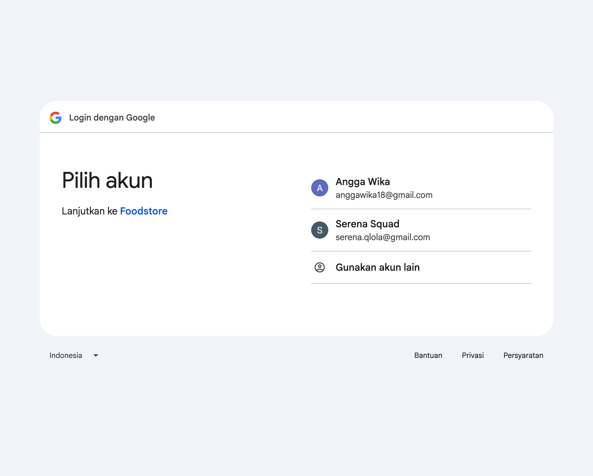

```
User klik "Sign in with Google"
        │
        ▼
GET /auth/google  →  Redirect ke Google Consent Screen
        │
        ▼ (user menyetujui)
GET /auth/google/callback  (ditangani passport-google-oauth20)
        │
        ├─► google_id ditemukan di DB
        │       → Login sebagai akun yang ada
        │
        ├─► Email ditemukan tapi tanpa google_id
        │       → tambahkan google_id dari response Google ke akun yang ada (merge, tanpa duplikat)
        │       → Login sebagai akun yang ada
        │
        └─► Email & google_id tidak ditemukan
                → Auto-register user baru (tanpa password)
                │
                ▼
        Cek verified:
        ├─► Belum verifikasi → kirim email && redirect ke /cek-email (lihat alur Verifikasi Email)
        └─► Sudah verifikasi → generate token, redirect ke:
                CLIENT_URL/#/auth/callback?token=<jwt>
                (redirect otomatis)
                │
                ▼
            Frontend membaca token dari URL params
            Simpan ke localStorage
            Redux dispatch userLogin
            Redirect ke /
```

---

### Alur Verifikasi Email

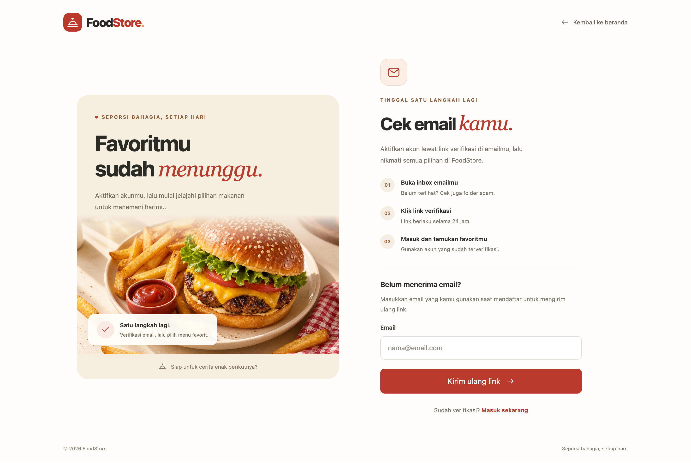

```
halaman cek email
        ▼
Kirim email berisi link:
  /verify-email?token=<uuid> (UI loading verifikasi)
  (link berlaku 24 jam)
        │
        ▼
User klik link di email
        │
        ▼
GET /auth/verify-email/:token
        │
        ├─► Token tidak valid / kedaluwarsa → error, arahkan kirim ulang di /cek-email
        └─► Token valid
                │
                ▼
            Set verified: true di DB
            Hapus token verifikasi
            Return { message: "Akun berhasil diverifikasi" }
            /verify-email?token=<uuid> (UI sukses verifikasi)
            User sudah bisa login normal
```

---

### Beranda

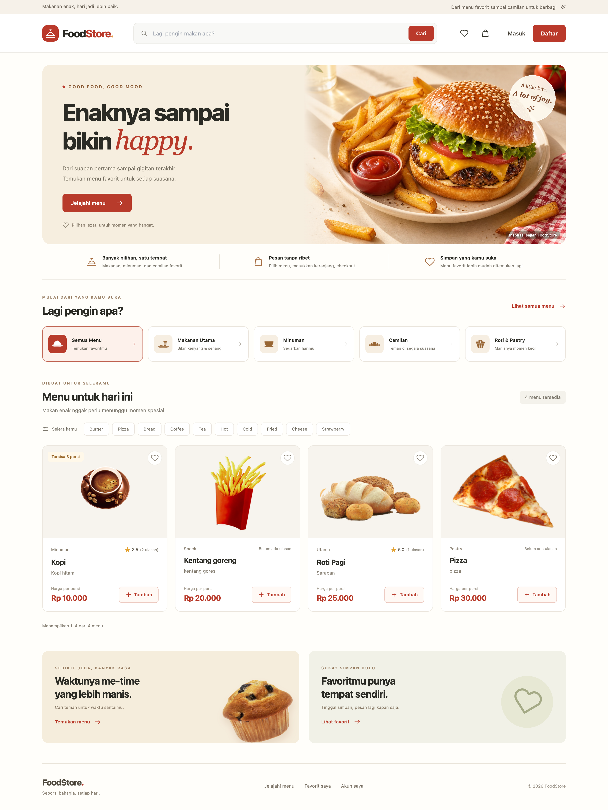

```
User buka halaman /
        │
        ▼
GET /api/products?limit=6&skip=0   ← load produk (Redux fetchProducts)
GET /api/categories                ← load kategori sidebar
GET /api/tags                      ← load tag filter
GET /api/wishlists                 ← load wishlist user (jika login)
        │
        ▼
Tampil grid produk
        │
        ├─► Klik kategori          → Redux setCategory → refetch products
        ├─► Klik tag               → Redux toggleTag   → refetch products
        ├─► Ketik search           → Redux setKeyword  → refetch products?q=<keyword>
        ├─► Pagination             → Redux setPage / goToNextPage → refetch products?skip=<n>
        │
        ├─► Klik ❤️ / 🤍 wishlist
        │       ├─► Belum login    → tidak ada aksi
        │       ├─► Sudah ada      → DELETE /api/wishlists/:product_id
        │       └─► Belum ada      → POST /api/wishlists
        │
        └─► Klik "Tambah ke Keranjang"
                ├─► Belum login    → redirect /login
                └─► Sudah login    → Redux addItem (update local state)
                                      PUT /api/carts (sync ke backend)
                                      icon cart di topbar update count
```

---

### Keranjang

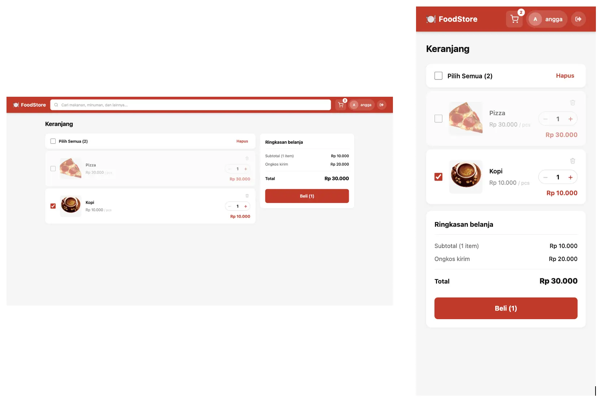

```
Halaman keranjang
        │
        ├─► Saat load             → GET /api/carts (muat keranjang dari server)
        │
        ├─► Centang/batal item    → Redux update → PUT /api/carts  body: { items: [{ _id, qty, checked }] }
        ├─► Checkbox pilih semua  → Redux update → PUT /api/carts  body: { items: [{ _id, qty, checked }] }
        ├─► Tombol +/- qty        → Redux update → PUT /api/carts  body: { items: [{ _id, qty, checked }] }
        ├─► Hapus (ikon sampah)   → Redux update → PUT /api/carts  body: { items: [{ _id, qty, checked }] }
        │
        └─► Klik "Beli (n)"
                │
                ▼
            Redirect ke /checkout
            (data keranjang dibawa via Redux — tanpa panggilan API saat Checkout dimuat)
```

---

## Checkout

Alur checkout 3 langkah dengan progress bar visual. Setiap langkah harus selesai sebelum lanjut.

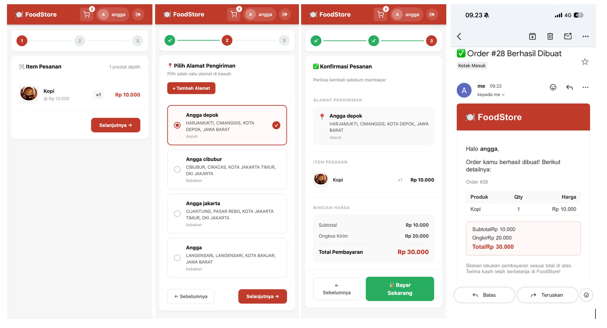

```
Saat Checkout dimuat → GET /api/delivery-addresses (preload alamat tersimpan)

Langkah 1 — Item Pesanan
        │
        Tinjau item terpilih, qty, dan harga (data dari Redux)
        │
        ▼
Klik "Selanjutnya →"

Langkah 2 — Alamat Pengiriman
        │
        Pilih dari alamat tersimpan (radio select)
        ├─► Belum punya alamat → klik "+ Tambah Alamat" → /alamat-pengiriman/tambah?from=checkout&step=2
        │
        ▼
Klik "Selanjutnya →"  (nonaktif jika belum memilih alamat)

Langkah 3 — Konfirmasi Pesanan
        │
        Tinjau: alamat pengiriman, item, subtotal, ongkir, total
        │
        ▼
Klik "🛒 Bayar Sekarang"
        │
        ▼
PUT /api/carts
        body: { "items": [
            { "_id": "prod_1", "qty": 2, "checked": true },
            { "_id": "prod_2", "qty": 1, "checked": true }
          ]}
        │
        │   Redux cart sebelum:
        │   [
              { _id: "prod_1", qty: 2, checked: true  },   ← dikirim
        │     { _id: "prod_2", qty: 1, checked: true  },   ← dikirim
        │     { _id: "prod_3", qty: 1, checked: false }]   ← tidak dikirim
        │
        │   Backend: deleteMany SEMUA cart user []
        │            insertMany [prod_1, prod_2] (hanya yang checked)
        │            DB cart: [prod_1, prod_2]
        │
        ▼
POST /api/orders
        body:     { "delivery_fee": 15000, "delivery_address": "addr_abc123" }
        response: {
          ...,
          "order_items": [
            { ...,  "product": "prod_1" },
            { ..., "product": "prod_2" }
          ]
        }

        │
        │   Backend: ambil CartItem checked:true
        │            DB cart saat ini: [
        │              { product: "prod_1", ... },
        │              { product: "prod_2", ... }
        │            ]
        │            → buat OrderItem (snapshot, disimpan ke collection order-items):
        │            [
        │              { ..., product: "prod_1" },
        │              { ..., product: "prod_2" }
        │            ]
        │            → deleteMany CartItem { checked: true }
        │            DB cart setelah: [] (kosong)
        ├─► Stok otomatis dikurangi
        │       Product.findByIdAndUpdate(prod_1, { $inc: { stock: -2 } })
        │       Product.findByIdAndUpdate(prod_2, { $inc: { stock: -1 } })
        │       sebelum: { _id: "prod_1", name: "Nasi Goreng", stock: 20 }
        │       sesudah: { _id: "prod_1", name: "Nasi Goreng", stock: 18 }
        │       jika stock <= 5 → Pusher trigger 'private-admin' event 'product:low_stock'
        ├─► Invoice dibuat (status: waiting_payment)
        └─► Email konfirmasi order dikirim via Nodemailer (fire-and-forget)
        │
        │
        │   Frontend pakai response:
        │   ├─► response._id → redirect ke /invoice/order_xyz789
        │   └─► dispatch(setItems([prod_3]))

            dispatch(
              setItems(cart.filter(i => !orderedIds.has(i._id)))
            ) hasil filter → [prod_3]  ← sisa yang tidak dibeli

        │
        │   Redux cart setelah:
        │   [{ _id: "prod_3", qty: 1, checked: false }]   ← sisa yang tidak dibeli
        │
        │   listener deteksi Redux berubah →
        │   PUT /api/carts body: { "items": [{ "_id": "prod_3", "qty": 1, "checked": false }] }
        │   DB cart setelah: [prod_3]
        │
        ▼
Redirect ke /invoice/order_xyz789
```

---

## Invoice & Pembayaran

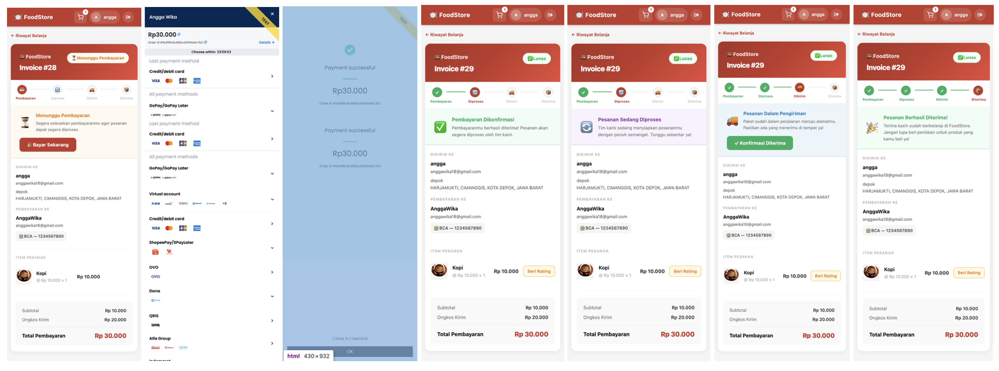

Siklus penuh invoice — dari pembayaran tertunda sampai setiap status order, dengan update real-time via Pusher.

```
Halaman invoice dimuat
        │
        ▼
GET /api/invoices/order/:order_id       ← muat data invoice + order
GET /api/reviews/my-order/:order_id     ← muat product id yang sudah direview
        │
        ▼
Banner status: ⏳ "Menunggu Pembayaran"
User klik "🔒 Bayar Sekarang"
        │
        ▼
GET /api/payments/token/:order_id
        │   backend: cek snap_token di DB
        │   ├─► ada → langsung kembalikan (lewati Midtrans, cegah double charge)
        │   └─► tidak ada → snap.createTransaction() → Midtrans API → terima token
        │                   simpan token ke invoice.snap_token di DB
        │   response: { snap_token: "..." }
        ↓
window.snap.pay(snap_token)  ← popup Midtrans Snap terbuka
        │
        ├─► User memilih metode pembayaran
        │   (Kartu kredit, GoPay, VA, QRIS, OVO, Dana, dll.)
        │   Midtrans menangani seluruh UI pembayaran secara internal
        │
        ▼
Hasil pembayaran → Midtrans memicu salah satu dari:
        │
        ├─► onSuccess(result)
        │       result: {
                  order_id: "invoice._id",
                  payment_type: "gopay",
                  gross_amount: "80000.00",
        │         transaction_status: "settlement", }
        │       → setInvoice({ payment_status: 'settlement' })  ← update lokal langsung
        │
        ▼
callback onSuccess
verifyPayment()
GET /api/payments/verify/:order_id
        │
        │   backend: Invoice.findOne({ order: order_id })     ← cari invoice by order_id
        │            snap.transaction.status(invoice._id)     ← cek status dari Midtrans API
        │            response dari Midtrans: { transaction_status: "settlement", fraud_status: "accept" }
        │
        │   pemetaan transaction_status → paymentStatus:
        │   capture + accept → settlement
        │   settlement       → settlement
        │   cancel/deny/expire → failed
        │   pending          → pending
        │
        │   Invoice.findByIdAndUpdate(invoice._id, { payment_status: "settlement" })
        │   Order.findByIdAndUpdate(order._id, { status: "processing" })
        │
        ├─► Pusher trigger 'private-admin' event 'payment:settlement'
        │       payload: { order_id, order_number: "38", amount: 80000 }
        │       → notifikasi toast ke admin
        │
        ├─► Pusher trigger 'private-order-<id>' event 'order:status_updated'
        │       payload: { order_id, status: "processing" }
        │       → halaman invoice menerima → order.status ter-update live (tanpa reload)
        │
        ├─► Kirim FCM ke mobile user (fire-and-forget)
        │       payload: { fcm_token, order_id, order_number, status: "processing", total, item_count }
        │
        └─► response: { payment_status: "settlement" }
                ↓
        setInvoice({ payment_status: "settlement" })  ← frontend konfirmasi dari server

━━━ Status Order Real-time (Pusher) ━━━

Admin mengubah status order dari /admin/orders
        │
        ▼
PUT /api/orders/:id/status
        │
        ▼
Event Pusher dipicu: order:status_updated
di channel: private-order-<id>
        │
        ▼
Halaman invoice menerima event → order.status ter-update live

Progres status & banner:
  ⏳  waiting_payment / pending  → "Menunggu Pembayaran"     + tombol 🔒 Bayar Sekarang
  ✅  settlement (default)       → "Pembayaran Dikonfirmasi"
  🔄  processing                 → "Pesanan Sedang Diproses"
  🚚  in_delivery                → "Pesanan Dalam Pengiriman" + tombol ✓ Konfirmasi Diterima
  🎉  delivered                  → "Pesanan Berhasil Diterima!"
  ❌  failed / deny / cancel / expire → "Pembayaran Gagal"
```

> Tombol **✓ Konfirmasi Diterima** ditampilkan ke user saat order berstatus `in_delivery`. Menekannya memanggil `PUT /api/orders/:id/status { status: "delivered" }` — user bisa mengonfirmasi penerimaan tanpa melalui admin.

---

## Review

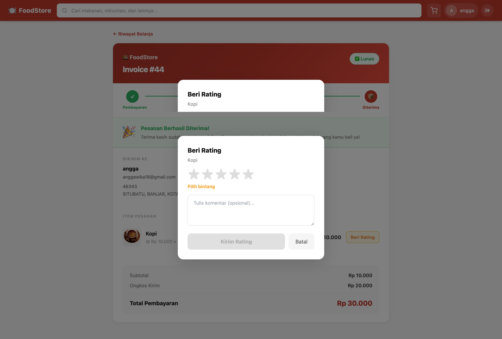

Review dikirim dari halaman Invoice setelah pembayaran dikonfirmasi. Setiap item order hanya bisa dinilai sekali per user.

```
Halaman invoice dimuat
        │
        ▼
GET /api/reviews?order_id=<order_id>   (dirantai setelah getInvoiceByOrderId)
  filter: { order: order_id, user: req.user._id }
  → { data: [{ _id, product: { _id }, rating, comment }] }
        │
        ▼
reviewedIds = data.map(r => r.product._id)
(melacak product_id mana di order ini yang sudah punya review)
        │
        ▼
Render daftar item order
  Untuk setiap item:
        ├─► payStatus ≠ settlement/paid/capture  → placeholder kosong (review belum tersedia)
        ├─► product._id ada di reviewedIds       → tampilkan badge "⭐ Dinilai"
        └─► belum direview                       → tampilkan tombol "Beri Rating"
                │
                ▼
        User klik "Beri Rating"
                │
                ▼
        Modal terbuka:
          nama produk
          StarRating (1–5)  ←→  teks petunjuk berubah live:
            1 → "Sangat buruk"
            2 → "Kurang memuaskan"
            3 → "Cukup baik"
            4 → "Bagus!"
            5 → "Sempurna! 🎉"
          Textarea komentar (opsional, maks 500 karakter)
          Tombol "Simpan Rating"
                │
                ▼
        User memilih bintang → komentar opsional → Submit
                │
                ├─► Belum pilih bintang → "Pilih bintang dulu ya!" (tetap di modal)
                │
                └─► POST /api/reviews  { product_id, order_id, rating, comment }
                        │
                        ▼
                Backend:
                  Simpan Review { user, product, order, rating, comment }
                  unique index pada { user, product } — satu review per produk per user
                        │
                        ├─► Duplikat (sudah pernah direview)
                        │       → error "Kamu sudah memberi rating untuk produk ini"
                        │
                        └─► Tersimpan
                                Hitung ulang avg_rating produk:
                                  allReviews = Review.find({ product: product_id })
                                  avg = sum(ratings) / count
                                  Product.update({ avg_rating: round(avg,1), review_count: count })
                                → kembalikan objek Review tersimpan
                                        │
                                        ▼
                                reviewedIds = [...prev, product_id]
                                Modal tertutup → tombol berubah jadi "⭐ Dinilai"
```

---

## Account

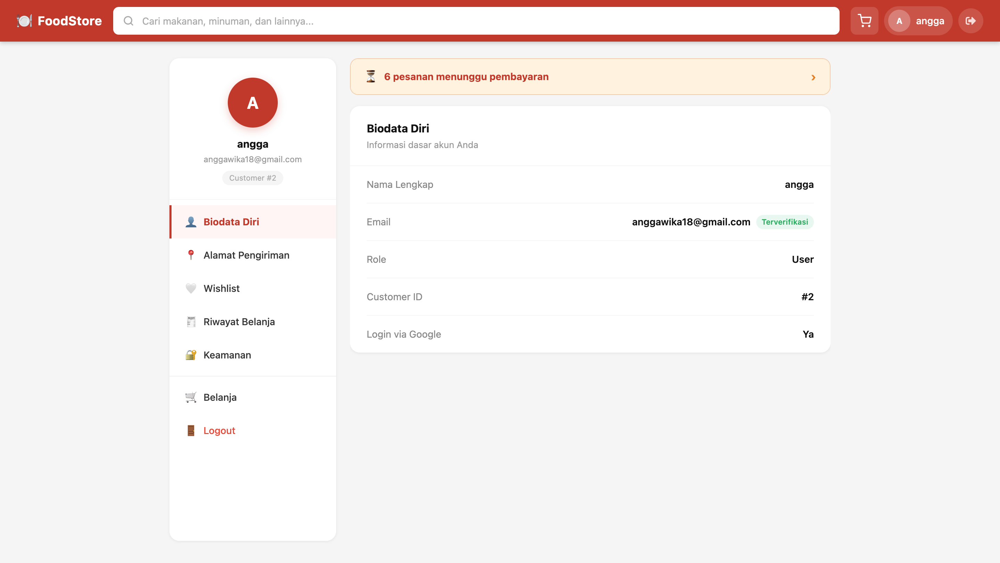

Halaman profil yang dapat diakses di `/account`. Berisi tab Biodata, Riwayat Belanja, Keamanan, serta tautan ke Alamat Pengiriman dan Wishlist.

```
User membuka /account
        │
        ▼
Cek auth (state auth Redux)
        ├─► Belum login → redirect ke /login
        └─► Sudah login → render halaman Account
                │
                ▼
        Baca query param ?tab= → set tab awal (default: biodata)
                │
                ▼
        Komponen mount — fetch kondisional berdasarkan role:
        │
        ├─► role: user
        │       GET /api/invoices?limit=20
        │       filter payment_status: waiting_payment | pending
        │       → tampilkan PendingBanner jika ada invoice belum dibayar
        │               Buka → daftar baris invoice (No. Order, total, "Bayar →")
        │               Klik baris → /invoice/<order_id>
        │
        └─► role: admin
                GET /api/orders?status=processing&limit=20
                → tampilkan AdminOrderBanner jika ada order yang perlu dikirim
                        Buka → daftar baris order (No. Order, pembeli, jumlah item, "Proses →")
                        Klik baris → /admin/orders
                │
                ▼
        Tab sidebar (SIDEBAR_TABS bersama — satu sumber kebenaran):
        ├─► Biodata Diri       → /account?tab=biodata   (render inline)
        ├─► Alamat Pengiriman  → /alamat-pengiriman     (pindah halaman)
        ├─► Wishlist           → /wishlist              (pindah halaman)
        ├─► Riwayat Belanja    → /account?tab=riwayat   (render inline)
        ├─► Keamanan           → /account?tab=keamanan  (render inline)
        └─► Admin Panel        → /account?tab=admin     (khusus admin, render inline)
```

```
tab = 'biodata'  (default)
        │
        ▼
Render dari state auth Redux — tanpa panggilan API
  Nama Lengkap  : user.full_name
  Email         : user.email  + badge "Terverifikasi"
  Role          : user.role
  Customer ID   : user.customer_id  (jika ada)
  Login via Google : user.google_id ? "Ya" : "Tidak"
```

---

## Riwayat Belanja


```
tab = 'riwayat'
        │
        ▼
GET /api/invoices?limit=20
  → [ { _id, total, payment_status, createdAt, order: { order_number, _id } } ]
        │
        ▼
Render daftar invoice
  Tiap baris: 🧾 No. Order · tanggal · total · badge status
  Logika badge status:
    settlement/paid/capture   → "Lunas"        (hijau)
    pending                   → "Menunggu"     (oranye)
    deny/cancel/expire/failed → "Gagal"        (merah)
    (tidak ada)               → "Belum Bayar"  (abu)
        │
        └─► Klik baris → /invoice/<order._id>
```

---

## Keamanan

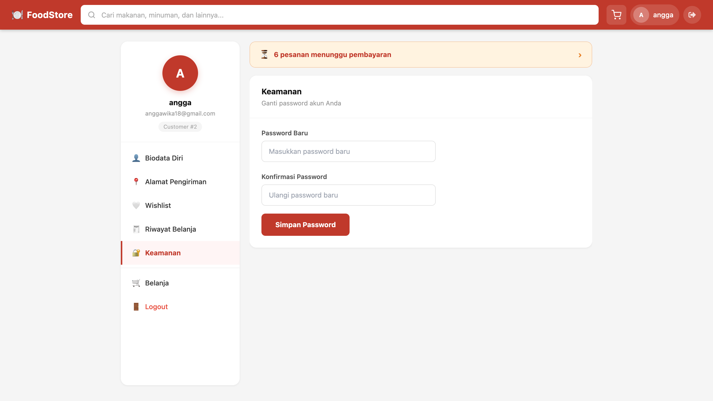

```
tab = 'keamanan'
        │
        ▼
Cek user.has_password
  ├─► false → tampilkan info box: "Akun ini terdaftar via Google, buat password untuk login tanpa Google"
  └─► true  → tampilkan "Ganti password akun Anda"
        │
        ▼
Form: Password Baru · Konfirmasi Password
        │
        ▼
Submit → POST /api/auth/set-password  { password, password_confirmation }
  ├─► error   → tampilkan pesan error
  └─► sukses  → tampilkan "Password berhasil disimpan!"
                dispatch(userLogin({ ...user, has_password: true }, token))
                (update Redux agar info box hilang)
```

---

## Admin Panel (khusus admin)


```
tab = 'admin'  DAN  user.role === 'admin'
        │
        ▼
Render grid menu admin (tanpa panggilan API)
  📊 Dashboard  → /admin/dashboard
  🍱 Produk     → /admin/product
  🗂️ Kategori   → /admin/categories
  🏷️ Tag        → /admin/tag
  📦 Pesanan    → /admin/orders
```

---

## Wishlist

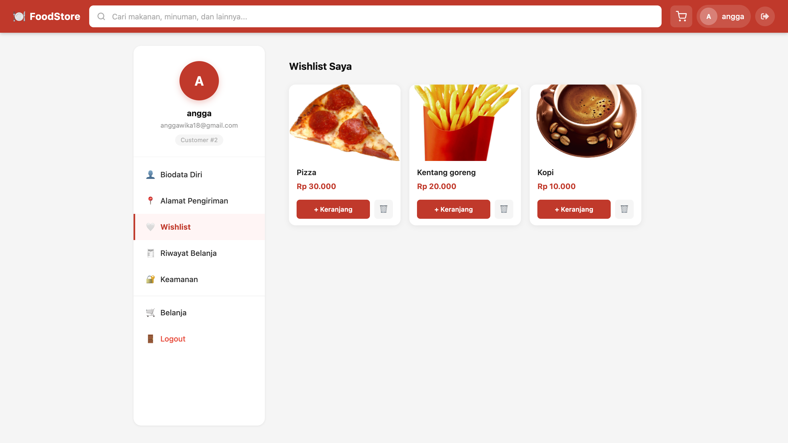

User dapat menyimpan produk dari halaman Beranda dan mengelolanya lewat sidebar profil.

```
User klik ikon 🤍 pada kartu produk
        │
        ▼
Cek auth (state auth Redux)
        ├─► Belum login → redirect ke /login
        └─► Sudah login
                │
                ▼
        POST /api/wishlists  { product_id: "prod_1" }
        → { _id: "wl_1", user: "user_1", product: "prod_1" }
                │
                ▼
        Ikon hati menjadi terisi (update state lokal)
```

```
User membuka /wishlist
        │
        ▼
Cek auth (state auth Redux)
        ├─► Belum login → redirect ke /login
        └─► Sudah login → render halaman Wishlist (AccountLayout, activeTab="wishlist")
                │
                ▼
        Komponen mount
        GET /api/wishlists
        → [
            { _id: "wl_1", product: { _id: "prod_1", name: "Nasi Goreng", price: 25000, image_url: "..." } },
            { _id: "wl_2", product: { _id: "prod_2", name: "Ayam Bakar",  price: 35000, image_url: "..." } }
          ]
                │
                ▼
        Render grid produk
        ├─► Tiap kartu: gambar · nama · harga · tombol 🗑 · tombol "+ Keranjang"
        │
        ├─► 🗑 Hapus dari wishlist
        │       DELETE /api/wishlists/prod_1
        │       → 200 OK
        │       State lokal: saring item yang dihapus (optimistic remove)
        │       items = [{ _id: "wl_2", product: { ... } }]
        │
        └─► + Keranjang (tambah ke keranjang)
                dispatch(addItem(product))   ← hanya Redux, tanpa panggilan API langsung
                        │
                        ▼
                listener.js mendeteksi perubahan state cart Redux
                        │
                        ▼
                PUT /api/carts  [{ _id: "prod_2", qty: 1, checked: true }]
                Backend mengambil ulang nama/harga/gambar dari Product (anti-manipulasi)
                → keranjang tersinkron ke backend
```

---

## Alamat Pengiriman

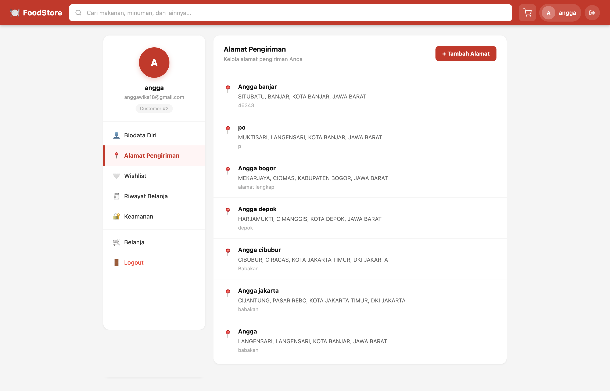

Dapat diakses dari sidebar profil (tab **Alamat Pengiriman**) atau lewat redirect dari Checkout Langkah 2. Wajib login.

### Read — Daftar Alamat (`/alamat-pengiriman`)

```
User membuka /alamat-pengiriman
        │
        ▼
AccountLayout dirender (activeTab="alamat")
        │
        ▼
Hook useAddressData() mount
        │
        ▼
GET /api/delivery-addresses?limit=10&skip=0
  DeliveryAddress.find({ user: req.user._id }).limit(10).skip(0).sort("-createdAt")
  → { data: [ { _id, nama, provinsi, kabupaten, kecamatan, kelurahan, detail } ] }
        │
        ▼
Render daftar alamat
  Tiap kartu: 📍 nama · kelurahan, kecamatan, kabupaten, provinsi · detail
        │
        ├─► count > limit → tombol paginasi
        │       setPage(n) → hook refetch dengan skip baru = (n * limit) - limit
        │
        └─► Datang dari Checkout? (URL: ?from=checkout&step=2)
                ├─► Tampilkan bar "← Kembali ke Checkout"
                ├─► Tombol "Pilih" di tiap kartu
                │       → redirect ke /checkout?step=2&address=<addr_id>
                └─► "+ Tambah Alamat" → /alamat-pengiriman/tambah?from=checkout&step=2
```

---

### Create — Tambah Alamat (`/alamat-pengiriman/tambah`)

```
User klik "+ Tambah Alamat"
        │
        ▼
Navigasi ke /alamat-pengiriman/tambah
        │
        ▼
Render form — dropdown wilayah bertingkat (komponen SelectWilayah):

  Provinsi dipilih
        │
        ▼
  GET /api/wilayah/kabupaten?kode_induk=<kode_provinsi>
  → opsi kabupaten/kota  (reset kabupaten, kecamatan, kelurahan)

  Kabupaten dipilih
        │
        ▼
  GET /api/wilayah/kecamatan?kode_induk=<kode_kabupaten>
  → opsi kecamatan  (reset kecamatan, kelurahan)

  Kecamatan dipilih
        │
        ▼
  GET /api/wilayah/desa?kode_induk=<kode_kecamatan>
  → opsi kelurahan/desa  (reset kelurahan)
        │
        ▼
User mengisi: Nama Alamat · Provinsi · Kabupaten · Kecamatan · Kelurahan · Detail
        │
        ▼
Submit → handleSubmit(onSubmit)
        │
        ▼
POST /api/delivery-addresses
  Cek policy CASL → user harus punya izin 'create' pada DeliveryAddress
  new DeliveryAddress({ ...payload, user: req.user._id }).save()
  → objek DeliveryAddress tersimpan
        │
        ├─► error → tampilkan pesan error, tetap di form
        ├─► Dari Checkout → redirect ke /alamat-pengiriman?from=checkout&step=2
        └─► Normal        → redirect ke /alamat-pengiriman
```

---

### Update — Edit Alamat

> Backend saja — belum ada halaman frontend.

```
PUT /api/delivery-addresses/:id
  DeliveryAddress.findOne({ _id: id })
  Cek policy CASL → khusus pemilik (address.user === req.user._id)
  DeliveryAddress.findOneAndUpdate({ _id: id }, payload, { new: true })
  → objek DeliveryAddress terupdate
```

---

### Delete — Hapus Alamat

> Backend saja — belum ada halaman frontend.

```
DELETE /api/delivery-addresses/:id
  DeliveryAddress.findOne({ _id: id })
  Cek policy CASL → khusus pemilik (address.user === req.user._id)
  DeliveryAddress.findOneAndDelete({ _id: id })
  → objek DeliveryAddress terhapus
```

---

## Dashboard Admin

Hanya dapat diakses user dengan `role: admin`. User non-admin diarahkan keluar oleh route guard `OnlyAdmin`.


```
Admin membuka /admin/dashboard
        │
        ▼
Guard OnlyAdmin memeriksa state auth Redux
        ├─► Bukan admin → redirect ke /
        └─► Admin → render Dashboard
                │
                ▼
        Komponen mount
        Jalankan 3 panggilan API paralel (Promise.all):
        │
        ├─► GET /api/dashboard/summary
        │       Agregasi Invoice (payment_status: settlement/paid/capture)
        │       Hitung Order, Product, User (role: user)
        │       → { total_revenue, total_orders, total_products, total_users }
        │
        ├─► GET /api/dashboard/revenue
        │       Agregasi Invoice 30 hari terakhir
        │       Group by tanggal (%Y-%m-%d)
        │       → [{ _id: "2024-01-01", revenue: 150000, orders: 3 }]
        │
        └─► GET /api/dashboard/top-products
                Agregasi OrderItem, group by product
                Urutkan total_qty DESC, limit 5
                Lookup collection products untuk nama + gambar
                → [{ name, image_url, total_qty, total_revenue }]
                        │
                        ▼
                State loading (BounceLoader) sampai ketiganya selesai
                        │
                        ▼
                Render:
                ├─► 4 Kartu Ringkasan (Revenue, Orders, Produk, User)
                ├─► Area Chart — Revenue 30 Hari Terakhir (Recharts)
                ├─► Bar Chart  — Orders per Hari (Recharts, chartData yang sama)
                └─► Top 5 Produk Terlaris (daftar berperingkat dengan gambar)
```
---

## Admin — Manajemen Produk


1. Retrieve
```
Admin membuka /admin/product
        │
        ▼
Komponen mount — jalankan 3 request paralel:
  ├─► GET /api/products?limit=10&skip=0   → daftar produk (paginasi, sisi server)
  ├─► GET /api/categories?limit=100       → isi dropdown kategori di form
  └─► GET /api/tags?limit=100             → isi checkbox tag di form

Backend (GET /api/products):
  Bangun criteria dari query params (q, category, tags)
  Product.find(criteria).limit().skip().populate('category').populate('tags')
  Return { data: [...], count: <total> }
        │
        ▼
Render DataTable (react-data-table-component):
  Kolom: Gambar · Nama · Harga · Kategori · Tag · Stok · Aksi
  Paginasi: sisi server, 10 per halaman
        │
        ├─► Logika badge stok:
        │       stock === 0   → badge merah "Habis"
        │       stock <= 5    → badge oranye "⚠ {n}"
        │       stock > 5     → angka biasa
        │
        └─► Ganti halaman → setPage(n) → fetch ulang dengan skip baru
```
2. Create

```
Admin klik "+ Tambah Produk"
        │
        ▼
Modal terbuka (selectedProduct = null)
Field form: Nama*, Deskripsi, Harga*, Stok*, Kategori (dropdown), Tag (checkbox), Gambar (file)
        │
        ▼
Admin mengisi form → klik "Simpan"
        │
        ▼
handleSubmit:
  Bangun FormData (multipart/form-data)
  POST /api/products  (multer memoryStorage — tanpa tulis ke disk)
        │
        ▼
Backend (store):
  CASL policy.can('create', 'Product') — khusus admin
  Resolusi tag: Tag.find({ name: { $in: payload.tags } }) → ganti nama dengan ObjectId[]
  Resolusi kategori: Category.findOne({ name: regex }) → ganti nama dengan ObjectId
  Jika ada gambar: uploadToCloudinary(req.file.buffer) → simpan secure_url
  new Product(payload).save()
  Kembalikan produk tersimpan
        │
        ▼
Frontend: tutup modal → fetch ulang daftar produk
```
3. Update

```
Admin klik "Edit" pada sebuah baris
        │
        ▼
Modal terbuka terisi data baris (selectedProduct = row)
Field gambar opsional — kosongkan untuk mempertahankan gambar lama
        │
        ▼
Admin mengubah field → klik "Update"
        │
        ▼
handleSubmit:
  Bangun FormData
  PUT /api/products/:id
        │
        ▼
Backend (update):
  CASL policy.can('update', 'Product') — khusus admin
  Resolusi tag & kategori sama seperti Create
  Jika ada file gambar baru:
    deleteFromCloudinary(existing.image_url)   ← gambar lama dihapus dari cloud
    uploadToCloudinary(req.file.buffer)        ← gambar baru diunggah
  Product.findOneAndUpdate({ _id }, payload, { new: true, runValidators: true })
  Kembalikan produk terupdate
        │
        ▼
Frontend: tutup modal → fetch ulang daftar produk
```
4. Delete

```
Admin klik "Delete" pada sebuah baris
        │
        ▼
window.confirm('Yakin hapus produk ini?')
  ├─► Batal → tidak terjadi apa-apa
  └─► OK
        │
        ▼
DELETE /api/products/:id
        │
        ▼
Backend (destroy):
  CASL policy.can('delete', 'Product') — khusus admin
  Product.findOneAndDelete({ _id })
  Return { message, data }
        │
        ▼
Frontend: fetch ulang daftar produk
```
5. Notifikasi stok menipis real-time & update stok saat user memesan

Stok tidak dikurangi manual — otomatis saat order dibuat:

```
POST /api/orders (checkout customer)
        │
        ▼
Untuk setiap item order:
  Product.findOneAndUpdate(
    { _id: item.product },
    { $inc: { stock: -item.qty } },
    { new: true }
  )
        │
        ├─► updated.stock <= 5
        │       Pusher memicu 'product:low_stock' di 'private-admin'
        │       Admin melihat toast stok menipis (oranye) secara real-time
        │
        └─► Badge stok di /admin/product ter-update pada fetch berikutnya
```

---

## Admin — Manajemen Order


```
Admin membuka /admin/orders
        │
        ▼
Komponen mount — jalankan 2 request paralel:
  ├─► GET /api/orders/stats
  │       Agregasi Order group by status
  │       → { total, by_status: { waiting_payment, processing, in_delivery, delivered, pending } }
  │       Dipakai untuk: 4 kartu statistik + badge jumlah pada tab
  │
  └─► GET /api/orders?limit=10&page=1
        Order.find().populate('order_items').populate('user').sort('-createdAt')
        → { data: [...], count }
        │
        ▼
Render:
  ├─► 4 Kartu Statistik (Total Order, Menunggu Bayar, Diproses/Dikirim, Diterima)
  ├─► Tab Status (Semua · Menunggu Bayar · Diproses · Dikirim · Diterima · Pending)
  │       Klik tab → setActiveTab + reset halaman → fetch ulang dengan ?status=<key>
  │
  └─► DataTable — paginasi sisi server, 10 per halaman
        Kolom: No. Order · Tanggal · Customer · Items · Total · Status · Aksi
        Klik baris → navigasi ke /admin/orders/:id (detail order)
```

### Alur Status & Tombol Aksi

Progres status bersifat satu arah, didefinisikan di `STATUS_FLOW`:

```
waiting_payment  →  (tanpa aksi — transisi ini ditentukan pembayaran)
processing       →  [→ Dikirim]   (berikutnya: in_delivery)
in_delivery      →  [→ Diterima]  (berikutnya: delivered)
delivered        →  —             (terminal)
pending          →  —             (terminal)
```

Kolom "Aksi" membaca `STATUS_FLOW[row.status].next` — jika `null`, tampil `—`. Selain itu render tombol `→ {nextLabel}`.

### Update Status (Admin)

```
Admin klik "→ Dikirim" atau "→ Diterima"
        │
        ▼
handleUpdateStatus(order, newStatus):
  setUpdatingId(order._id)   ← nonaktifkan tombol selama request berjalan
  PUT /api/orders/:id/status  { status: newStatus }
        │
        ▼
Backend (updateStatus):
  req.user.role === 'admin'
  Nilai yang diizinkan: ['processing', 'in_delivery', 'delivered']
  Order.findByIdAndUpdate({ _id }, { status }, { new: true })
        │
        ▼
  pusher.trigger(`private-order-${order._id}`, 'order:status_updated', {
      order_id, status
  })
        │
        ▼
Frontend (AdminOrders):
  Optimistic update → setOrders(prev.map patch status di tempat)
  Fetch ulang stats → badge jumlah pada tab ter-update
```

### Update Real-time ke Customer (Pusher)

```
Customer sedang di halaman /invoice/:order_id
        │
        ▼
useEffect saat mount:
  pusher.subscribe(`private-order-${order_id}`)
  channel.bind('order:status_updated', ({ status }) => {
      setInvoice(prev => { ...prev, order: { ...prev.order, status } })
  })
        │
        ▼
Saat admin mengubah status (di atas):
  Pusher menyiarkan 'order:status_updated' di channel tersebut
        │
        ▼
Halaman invoice customer menerima event — banner status ter-update live:
  processing   → "🔄 Pesanan Sedang Diproses"
  in_delivery  → "🚚 Pesanan Dalam Pengiriman" + tombol "✓ Konfirmasi Diterima"
  delivered    → "🎉 Pesanan Berhasil Diterima!"

Tanpa perlu reload halaman.

Saat unmount: channel.unbind_all() + pusher.unsubscribe(channel)
```

### Konfirmasi Penerimaan oleh User

```
Customer klik "✓ Konfirmasi Diterima" (hanya tampil saat status = in_delivery)
        │
        ▼
PUT /api/orders/:id/status  { status: 'delivered' }
        │
        ▼
Backend (updateStatus — cabang user):
  status harus 'delivered'
  existing.user harus sama dengan req.user._id   ← cek kepemilikan
  existing.status harus 'in_delivery'            ← cegah transisi tidak valid
  Update → Pusher memicu event 'order:status_updated' yang sama
```

### Export Excel

```
Admin klik "⬇ Export Excel"
        │
        ▼
GET /api/orders/export  (khusus admin, tanpa paginasi)
  Order.find().populate('order_items').populate('user').sort('-createdAt')
  → semua order
        │
        ▼
Sisi klien (SheetJS):
  Sheet 1 "Ringkasan Order" — satu baris per order
    (No. Order, Tanggal, Customer, Email, Jumlah Item, Sub Total, Ongkir, Total, Status, Alamat)
  Sheet 2 "Detail Items" — satu baris per baris produk
    (No. Order, Tanggal, Customer, Nama Produk, Qty, Harga Satuan, Subtotal)
  XLSX.writeFile → unduh laporan-order-{tanggal}.xlsx
  Tidak ada file yang dibuat di server.
```

---

## API Endpoints

Base URL: `http://localhost:3000`

> Endpoint auth berada di bawah `/auth`. Endpoint lainnya diawali prefix `/api`.

---

### Auth

**`POST /auth/register`**
**Body (form-data)**
```json
{ "full_name": "string", "email": "string", "password": "string" }
```
**Response**
```json
{ "message": "Register success" }
```

**`POST /auth/login`**
**Body (form-data)**
```json
{ "email": "string", "password": "string" }
```
**Response**
```json
{ "user": { "_id": "", "full_name": "", "role": "user" }, "token": "<jwt>" }
```

**`GET /auth/me`**
Membutuhkan `Authorization: Bearer <token>`. Mengembalikan user yang sedang login.

**`POST /auth/logout`**
Membutuhkan `Authorization: Bearer <token>`.

**`GET /auth/verify-email/:token`**
Verifikasi email dari link. Token harus ada di DB dan belum kedaluwarsa.

**Response**
```json
{ "message": "Akun berhasil diverifikasi" }
```
Jika gagal:
```json
{ "error": 1, "message": "Link verifikasi tidak valid atau sudah expired" }
```

**`POST /auth/resend-verification`**
Kirim ulang email verifikasi. Dipakai di halaman `/cek-email` saat user tidak menerima link.

**Body (form-data)**
```json
{ "email": "string" }
```
**Response**
```json
{ "message": "Link verifikasi telah dikirim ulang" }
```

---

**`GET /auth/google`**
Arahkan browser ke halaman consent Google. Tanpa body — buka langsung di browser (bukan lewat axios).

**`GET /auth/google/callback`**
Google mengarahkan ke sini setelah user menyetujui. Ditangani otomatis oleh `passport-google-oauth20`.
Redirect ke `CLIENT_URL/#/auth/callback?token=<jwt>` jika sukses.

**Logika merge:**
- `google_id` ditemukan di DB → user Google lama, langsung login
- Email ditemukan tapi tanpa `google_id` → akun email/password lama, kaitkan `google_id` ke akun itu
- Keduanya tidak ditemukan → auto-register user baru (tanpa password)

**`POST /auth/google/mobile` — Khusus mobile (Flutter / React Native)**
Login Google dari aplikasi mobile. Aplikasi mobile mengirim `id_token` dari Google SDK — tidak pakai redirect browser.

**Body**
```json
{ "id_token": "<id_token dari Google SDK>" }
```
**Response sukses**
```json
{ "message": "logged in successfully", "user": { "_id": "", "full_name": "", "role": "user" }, "token": "<jwt>" }
```
**Response belum verifikasi email**
```json
{ "error": 1, "message": "email_not_verified", "email": "user@gmail.com" }
```

Logika merge sama persis seperti OAuth web. Cara pakai:
- **Flutter:** `google_sign_in` → `googleUser.authentication.idToken`
- **React Native:** `@react-native-google-signin/google-signin` → `GoogleSignin.signIn().idToken`

---

### User

**`PUT /api/users/set-password` — Wajib login**
Set atau ganti password. Dipakai user Google yang ingin mengaktifkan login email/password.

**Body**
```json
{ "password": "string", "password_confirmation": "string" }
```
**Response**
```json
{ "message": "Password berhasil disimpan" }
```

**`PUT /api/users/avatar` — Wajib login**
Unggah foto profil user. Disimpan di Cloudinary (`foodstore/avatars`). Gambar lama otomatis dihapus.

**Body (form-data):** `image` (file, maks 5MB)

**Response**
```json
{ "message": "Avatar berhasil diupdate", "image_url": "https://res.cloudinary.com/..." }
```

**`PUT /api/users/mobile/fcm-token` — Wajib login**
Simpan FCM token dari perangkat mobile. Dipakai untuk mengirim push notification saat status order berubah.

**Body**
```json
{ "fcm_token": "string" }
```
**Response**
```json
{ "message": "FCM token tersimpan" }
```

---

### Upload — Wajib login

**`POST /api/upload`**
Upload gambar serbaguna ke Cloudinary (`foodstore/uploads`). Untuk aplikasi mobile yang perlu mengunggah gambar di luar alur produk/avatar.

**Body (form-data):** `image` (file, maks 5MB)

**Response**
```json
{ "url": "https://res.cloudinary.com/...", "public_id": "foodstore/uploads/xxx", "width": 1080, "height": 720 }
```

---

### Product

**`GET /api/products`**
**Query params:** `limit`, `skip`, `q` (kata kunci), `category`, `tags[]`

**Response**
```json
{ "data": [ { "_id": "", "name": "", "price": 0, "image_url": "", "stock": 0 } ], "count": 0 }
```

**`POST /api/products` — Khusus admin**
**Body (form-data):** `name`, `description`, `price`, `category`, `tags[]`, `image` (file)

**Response:** objek produk yang dibuat

**`PUT /api/products/:id` — Khusus admin**
Field sama dengan POST, semuanya opsional. Gambar lama otomatis dihapus dari Cloudinary saat update.

**`DELETE /api/products/:id` — Khusus admin**
**Response**
```json
{ "message": "Product deleted" }
```

---

### Category

**`GET /api/categories`**
**Response**
```json
{ "data": [ { "_id": "", "name": "" } ], "count": 0 }
```

**`POST /api/categories`**
**Body:** `{ "name": "string" }`

**`PUT /api/categories/:id`**
**Body:** `{ "name": "string" }`

**`DELETE /api/categories/:id`**

---

### Tag

**`GET /api/tags`**
**`POST /api/tags` — **Body:** `{ "name": "string" }`**
**`PUT /api/tags/:id` — **Body:** `{ "name": "string" }`**
**`DELETE /api/tags/:id`**

---

### Delivery Address — Wajib login

**`GET /api/delivery-addresses`**
**Response**
```json
[ { "_id": "", "nama": "", "provinsi": "", "kabupaten": "", "kecamatan": "", "kelurahan": "", "detail": "" } ]
```

**`POST /api/delivery-addresses`**
**Body**
```json
{ "nama": "string", "provinsi": "string", "kabupaten": "string", "kecamatan": "string", "kelurahan": "string", "detail": "string" }
```

**`PUT /api/delivery-addresses/:id` — Khusus pemilik**
**Body**
```json
{ "nama": "string", "provinsi": "string", "kabupaten": "string", "kecamatan": "string", "kelurahan": "string", "detail": "string" }
```
**Response** — objek DeliveryAddress terupdate

**`DELETE /api/delivery-addresses/:id` — Khusus pemilik**
**Response** — objek DeliveryAddress terhapus

---

### Cart — Wajib login

**`GET /api/carts`**
**Response**
```json
{ "items": [ { "_id": "", "product": {}, "qty": 1 } ] }
```

**`PUT /api/carts`**
**Body**
```json
{ "items": [ { "_id": "<product_id>", "qty": 2 } ] }
```

---

### Order — Wajib login

**`GET /api/orders`**
**Query params:** `limit`, `skip`, `status` (opsional — filter berdasarkan status order)

**Response**
```json
{ "data": [ { "_id": "", "status": "processing", "delivery_fee": 20000, "user": { "full_name": "", "email": "" }, "order_items": [], "createdAt": "" } ], "count": 0 }
```

**`GET /api/orders/stats` — Khusus admin**
Mengembalikan jumlah order yang dikelompokkan per status.

**Response**
```json
{ "total": 42, "by_status": { "waiting_payment": 5, "processing": 3, "in_delivery": 2, "delivered": 30, "pending": 2 } }
```

**`GET /api/orders/export` — Khusus admin**
Mengembalikan semua order (tanpa paginasi) dengan `user` dan `order_items` ter-populate. Dipakai untuk pembuatan Excel di sisi klien.

**Response**
```json
{ "data": [ { "_id": "", "order_number": 1, "status": "", "delivery_fee": 0, "delivery_address": {}, "user": { "full_name": "", "email": "" }, "order_items": [ { "name": "", "qty": 1, "price": 0 } ], "createdAt": "" } ] }
```

**`POST /api/orders`**
Membuat order dari keranjang saat ini. Mengurangi stok produk secara otomatis. Mengirim email konfirmasi order.

**Body**
```json
{ "delivery_fee": 20000, "delivery_address": "<address_id>" }
```
**Response:** objek order yang dibuat

**`GET /api/orders/:id`**
**Response:** satu objek order dengan `order_items`, `user`, dan `invoice` terkait (payment_status, total, sub_total).

**`PUT /api/orders/:id/status` — Wajib login**
**Body**
```json
{ "status": "processing | in_delivery | delivered" }
```
- **Admin** — dapat menetapkan ketiga status tersebut
- **User** — hanya dapat menetapkan `delivered` pada order miliknya saat status saat ini `in_delivery` (konfirmasi penerimaan)

**Response:** objek order terupdate. Juga memicu event Pusher `order:status_updated` di `private-order-<id>`.

---

### Invoice — Wajib login (khusus pemilik)

**`GET /api/invoices`**
Mengembalikan semua invoice milik user yang sedang login.

**Query params:** `limit`, `skip`

**Response**
```json
{ "data": [ { "_id": "", "order": {}, "payment_status": "waiting_payment", "total": 0, "createdAt": "" } ], "count": 0 }
```

**`GET /api/invoices/:order_id`**
**Response**
```json
{ "_id": "", "order": { "_id": "", "status": "", "order_items": [], "order_number": 0 }, "payment_status": "waiting_payment", "sub_total": 0, "delivery_fee": 0, "total": 0, "delivery_address": {}, "user": {} }
```

---

### Payment (Midtrans)

**`GET /api/payments/token/:order_id` — Wajib login**
Ambil Snap token untuk membuka popup pembayaran Midtrans.

**Response**
```json
{ "token": "<snap_token>" }
```

**`GET /api/payments/verify/:order_id` — Wajib login**
Sinkronisasi paksa status pembayaran dari Midtrans API ke database. Panggil setelah popup pembayaran tertutup.

**Response**
```json
{ "payment_status": "settlement | pending | deny | cancel | expire" }
```

**`POST /api/payments/notification`**
Webhook Midtrans — dipanggil otomatis oleh server Midtrans setelah event pembayaran.

**Body (dikirim Midtrans)**
```json
{ "order_id": "", "transaction_status": "settlement", "fraud_status": "accept" }
```

---

### Review

**`POST /api/reviews` — Wajib login**
**Body**
```json
{ "product_id": "", "order_id": "", "rating": 5, "comment": "string" }
```

**`GET /api/reviews`**
**Query params:** `product_id`, `order_id`

**Response**
```json
[ { "_id": "", "user": {}, "rating": 5, "comment": "", "createdAt": "" } ]
```

---

### Wishlist — Wajib login

**`GET /api/wishlists`**
**Response**
```json
[ { "_id": "", "product": { "_id": "", "name": "", "price": 0, "image_url": "" } } ]
```

**`POST /api/wishlists`**
**Body**
```json
{ "product_id": "<product_id>" }
```

**`DELETE /api/wishlists/:product_id`**

---

### Dashboard — Khusus admin

**`GET /api/dashboard/summary`**
**Response**
```json
{ "total_revenue": 0, "total_orders": 0, "total_products": 0, "total_users": 0 }
```

**`GET /api/dashboard/revenue`**
Pendapatan dan jumlah order per hari, 30 hari terakhir.

**Response**
```json
[ { "date": "2024-01-01", "revenue": 150000, "orders": 3 } ]
```

**`GET /api/dashboard/top-products`**
5 produk terlaris.

**Response**
```json
[ { "product": { "name": "", "image_url": "" }, "total_qty": 20, "total_revenue": 300000 } ]
```

---

### Pusher Auth

**`POST /api/pusher/auth` — Wajib login**
Autentikasi private channel Pusher. Dipanggil otomatis oleh client Pusher JS saat subscribe ke channel `private-*`.

**Body**
```json
{ "socket_id": "string", "channel_name": "private-admin | private-order-<id>" }
```
**Response**
```json
{ "auth": "<pusher_signature>" }
```

Channel yang dipakai:
- `private-admin` — admin menerima toast pembayaran lunas dan peringatan stok menipis
- `private-order-<id>` — customer menerima update status order real-time

---

### Wilayah (Data Wilayah Indonesia)

Data wilayah Indonesia dari file CSV. Filter menggunakan `kode_induk` (kode numerik dari level di atasnya).

**`GET /api/wilayah/provinsi`**
**Response**
```json
[ { "kode": "11", "nama": "ACEH" }, { "kode": "32", "nama": "JAWA BARAT" } ]
```

**`GET /api/wilayah/kabupaten?kode_induk=<kode_provinsi>`**
**Query params:** `kode_induk` — `kode` dari provinsi

**Contoh:** `GET /api/wilayah/kabupaten?kode_induk=32`
```json
[ { "kode": "3201", "kode_provinsi": "32", "nama": "KABUPATEN BOGOR" } ]
```

**`GET /api/wilayah/kecamatan?kode_induk=<kode_kabupaten>`**
**Query params:** `kode_induk` — `kode` dari kabupaten/kota

**Contoh:** `GET /api/wilayah/kecamatan?kode_induk=3201`
```json
[ { "kode": "3201010", "kode_kabupaten": "3201", "nama": "CIOMAS" } ]
```

**`GET /api/wilayah/desa?kode_induk=<kode_kecamatan>`**
**Query params:** `kode_induk` — `kode` dari kecamatan

**Contoh:** `GET /api/wilayah/desa?kode_induk=3201010`
```json
[ { "kode": "3201010001", "kode_kecamatan": "3201010", "nama": "MEKARJAYA" } ]
```

---

## Cara Menjalankan

> **Node.js >= 20** wajib (untuk kompatibilitas `firebase-admin` dan `expo-server-sdk`). Gunakan `nvm use 20` atau lebih tinggi.

### Backend

```bash
cd foodstore-server
npm install
# Buat file .env (lihat Environment Variables di bawah)
# Opsional: letakkan firebase-service-account.json di foodstore-server/ untuk mengaktifkan push notification FCM
npm run dev   # development (nodemon)
# atau
npm start     # production
```

Server berjalan di `http://localhost:3000`

### Frontend

```bash
cd foodstore-web
npm install
# Buat file .env (lihat Environment Variables di bawah)
npm start
```

Frontend berjalan di `http://localhost:3001`

---

## Environment Variables

### `foodstore-server/.env`

```
PORT=3000
MONGODB_URI=mongodb+srv://<user>:<pass>@cluster.mongodb.net/foodstore
SECRET_KEY=your_secret_key

# Cloudinary
CLOUDINARY_CLOUD_NAME=
CLOUDINARY_API_KEY=
CLOUDINARY_API_SECRET=

# Nodemailer (Gmail App Password)
MAIL_USER=
MAIL_PASS=

# Midtrans (Sandbox)
MIDTRANS_SERVER_KEY=
MIDTRANS_CLIENT_KEY=
MIDTRANS_IS_PRODUCTION=false

# Pusher
PUSHER_APP_ID=
PUSHER_KEY=
PUSHER_SECRET=
PUSHER_CLUSTER=

# Google OAuth (verifikasi id_token web + mobile)
GOOGLE_CLIENT_ID=
GOOGLE_CLIENT_SECRET=
GOOGLE_CALLBACK_URL=http://localhost:3000/auth/google/callback
CLIENT_URL=http://localhost:3001
```

> **Push Notification FCM (opsional):** Unduh service account JSON Firebase dari Firebase Console → Project Settings → Service Accounts → Generate new private key. Ganti namanya menjadi `firebase-service-account.json` dan letakkan di `foodstore-server/`. Server mendeteksi file tersebut otomatis — jika tidak ada, push notification dinonaktifkan secara diam-diam.

### `foodstore-web/.env`

```
REACT_APP_API_HOST=http://localhost:3000
REACT_APP_SITE_TITLE=FoodStore
REACT_APP_GLOBAL_ONGKIR=20000
REACT_APP_OWNER=YourName
REACT_APP_CONTACT=your@email.com
REACT_APP_BILLING_NO=1234567890
REACT_APP_BILLING_BANK=BCA
REACT_APP_PUSHER_KEY=
REACT_APP_PUSHER_CLUSTER=
```

---

## Role & Hak Akses (CASL)

| Role  | Akses |
|-------|-------|
| guest | Membaca produk |
| user  | CRUD alamat pengiriman sendiri, update keranjang, membuat & melihat order, membaca invoice sendiri, mengelola wishlist, konfirmasi penerimaan order sendiri |
| admin | Mengelola semua resource (akses penuh) |

---
