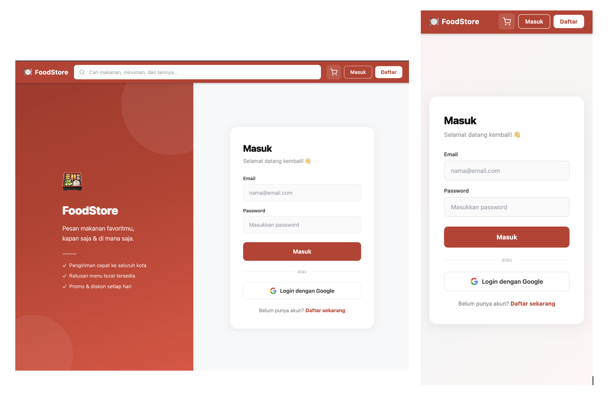

# Fullstack MERN Foodstore

A full-featured food e-commerce application built with the MERN Stack (MongoDB, Express, React, Node.js). Users can browse food products, add to cart, checkout with delivery address, pay via Midtrans, track order status in real-time, confirm delivery, and review purchased items. Admins can manage products, categories, orders, and monitor a live dashboard with revenue charts, low-stock alerts, and Excel export.

---

## Coming soon

- Rekomendasi produk AI — integrasi OpenAI API
- monitoring Sentry — error tracking production, tau kalau ada crash di user
- revamp ui

- PWA (Progressive Web App) — bisa di-install di HP, offline mode, push notif native
- Jest + React Testing Library — unit test komponen React
- TanStack Query (React Query) — gantikan manual loading/error state, auto cache, refetch. Jauh lebih clean dari Redux untuk server state
- Swagger / OpenAPI — auto-generate dokumentasi API dari kode. Profesional banget untuk portfolio

## New Features

- **Midtrans Payment Gateway** — Snap popup integration, invoice can be paid directly (sandbox mode)
- **Wishlist** — save favourite products, toggle ❤️ on product card, `/wishlist` page
- **Admin Dashboard** — 30-day revenue chart, orders per day, top 5 best-selling products, summary cards
- **Admin Order Management** — admin updates order status from UI (processing → in_delivery → delivered)
- **Rating & Review** — product review only available after payment settlement
- **Cloudinary Image Upload** — product images stored in cloud, old image auto-deleted on update
- **Order Confirmation Email** — sent automatically via Nodemailer on checkout (fire-and-forget)
- **Stock Management** — stock decremented automatically via `$inc` when order is created
- **Pusher Real-time Notifications** — admin gets instant toast when payment settles, customer sees order status update live (Pusher used instead of Socket.io for Vercel serverless compatibility)
- **Google OAuth** — login with Google account via `passport-google-oauth20`. Smart account merge: if the Google email already exists in DB (registered via email/password), `google_id` is linked to the existing account — no duplicate accounts. New Google users are auto-registered without a password. Users can optionally set a password later from the Account page to enable both login methods on the same account.
- **Email Verification** — all new accounts (email/password or Google) must verify their email before logging in. A verification link is sent via Nodemailer and expires in 24 hours. If the link expires or login is attempted before verifying, a new link is automatically re-sent and the user is redirected to `/cek-email`.
- **Export Laporan Excel** — admin can export all orders to `.xlsx` with 2 sheets: "Ringkasan Order" (per-order summary with customer, address, total, status) and "Detail Items" (per-product-line with qty, price, subtotal). Generated client-side via SheetJS (`xlsx`), no server file generation needed.
- **Low Stock Alert** — when an order causes a product's stock to drop to ≤ 5, a Pusher `product:low_stock` event is fired on `private-admin`. Admin sees an orange toast panel (separate from payment toasts) showing the product name and remaining stock. Clicking navigates to the product management page. Toasts auto-dismiss after 8 seconds.

  | Condition                    | Email/Password                                       | Google OAuth                                         |
  |------------------------------|------------------------------------------------------|------------------------------------------------------|
  | New user                     | `verified: false`, send email, redirect `/cek-email` | `verified: false`, send email, redirect `/cek-email` |
  | Not verified yet             | Resend email, redirect `/cek-email`                  | Resend email, redirect `/cek-email`                  |
  | Already verified             | Login success                                        | Login success                                        |
  | Old user (no verified field) | Resend email, redirect `/cek-email`                  | Resend email, redirect `/cek-email`                  |

---

## Features

- Product listing with search by keyword, category, and tags
- User registration & login (JWT-based auth + Google OAuth)
- Email verification before first login
- Shopping cart (per-user, isolated)
- Checkout with delivery address selection
- Midtrans Snap payment gateway (sandbox)
- Order history & invoice detail with visual timeline
- Real-time order status tracking via Pusher
- User can confirm delivery directly from invoice page
- Product rating & review (only after payment settled)
- Wishlist — save favourite products
- Manage delivery addresses with Indonesian regional data (province, city, district, village)
- Account page with collapsible pending-payment banner (user) / pending-orders banner (admin)
- Admin product, category & order management
- Admin dashboard — revenue chart, top products, summary cards
- Low-stock alert via Pusher when stock ≤ 5
- Export all orders to Excel (client-side, SheetJS)
- Role-based access control (guest / user / admin)

---

## Roles & Permissions (CASL)

| Role  | Access |
|-------|--------|
| guest | Read products |
| user  | CRUD own delivery addresses, update cart, create & view orders, read own invoices, manage wishlist, confirm own delivery |
| admin | Manage all resources (full access) |

---

## Project Structure

```
fullstack-mern-foodstore/
├── foodstore-server/                  # Backend (Node.js + Express)
│   ├── app/
│   │   ├── auth/                      # Register, login, logout, me, Google OAuth
│   │   ├── cart/                      # Shopping cart
│   │   ├── cart-item/                 # Cart item model
│   │   ├── category/                  # Product categories
│   │   ├── dashboard/                 # Admin dashboard stats & charts
│   │   ├── delivery-address/          # Delivery addresses
│   │   ├── invoice/                   # Order invoices
│   │   ├── order/                     # Orders
│   │   ├── order-item/                # Order items
│   │   ├── payment/                   # Midtrans Snap payment gateway
│   │   ├── policy/                    # Role-based access control (CASL)
│   │   ├── product/                   # Food products
│   │   ├── review/                    # Product reviews & ratings
│   │   ├── tag/                       # Product tags
│   │   ├── user/                      # User model + set-password endpoint
│   │   ├── pusher-auth/               # Pusher private channel auth endpoint
│   │   ├── wilayah/                   # Indonesian regional data (CSV-based)
│   │   ├── wishlist/                  # Wishlist
│   │   ├── utils/
│   │   │   ├── cloudinary.js          # Cloudinary upload helper
│   │   │   ├── mailer.js              # Nodemailer transporter
│   │   │   └── get-token.js           # JWT token helper
│   │   └── config.js
│   ├── database/                      # MongoDB connection
│   └── app.js                         # Express entry point
│
└── foodstore-web/                     # Frontend (React)
    └── src/
        ├── api/                       # Axios API call layer
        │   ├── auth.js                # login, register, logout, getMe, setPassword
        │   ├── cart.js
        │   ├── category.js
        │   ├── dashboard.js
        │   ├── invoice.js
        │   ├── orders.js
        │   ├── payment.js
        │   ├── products.js
        │   ├── review.js
        │   ├── tag.js
        │   └── wishlist.js
        ├── app/                       # Redux store & middleware listener
        ├── component/                 # Reusable components
        │   ├── AppSidebar/            # Category & admin navigation
        │   ├── Cart/                  # Cart drawer
        │   ├── OnlyAdmin/             # Admin route guard
        │   ├── OnlyGuest/             # Guest route guard
        │   ├── OnlyLogin/             # Auth route guard
        │   ├── SelectWilayah/         # Indonesian region selector
        │   ├── SocketNotification/    # Pusher real-time notification panel (admin)
        │   ├── StarRating/            # Star rating display
        │   ├── StatusLabel/           # Payment status badge
        │   └── Topbar/                # Top navigation bar
        ├── features/                  # Redux slices
        │   ├── Auth/
        │   ├── Cart/
        │   ├── categories/
        │   └── products/
        ├── hooks/                     # Custom React hooks
        ├── pages/                     # Application pages
        │   ├── 404/
        │   ├── Account/               # Profile, order history, set password
        │   ├── AdminOrderDetail/      # Admin order detail page
        │   ├── AdminOrders/
        │   ├── AuthCallback/          # Google OAuth callback — reads token from URL
        │   ├── CekEmail/              # "Silakan cek email" prompt after register or unverified login
        │   ├── VerifyEmail/           # Process verification token from email link
        │   ├── Checkout/
        │   ├── Dashboard/
        │   ├── Home/
        │   ├── Login/                 # Email/password + Google login button
        │   ├── Register/
        │   ├── RegisterSucces/
        │   ├── UserAddressAdd/
        │   ├── Wishlist/
        │   ├── categories/
        │   ├── invoice/
        │   ├── logout/
        │   ├── product/
        │   ├── tag/
        │   └── userAddress/
        ├── styles/
        └── utils/
```

---

## Pages

| Path | Page | Access |
|------|------|--------|
| `/` | Home — product listing | Everyone |
| `/login` | Login — email/password + Google OAuth button | Guest only |
| `/register` | Register new account | Guest only |
| `/register/berhasil` | Registration success | Guest only |
| `/logout` | Logout | Login only |
| `/account` | Account profile & order history | Login only |
| `/wishlist` | Wishlist | Login only |
| `/alamat-pengiriman/` | Delivery address list | Login only |
| `/alamat-pengiriman/tambah` | Add delivery address | Login only |
| `/checkout` | Checkout | Login only |
| `/invoice/:order_id` | Invoice detail + Midtrans payment | Login only |
| `/admin/dashboard` | Admin dashboard | Admin only |
| `/admin/orders` | Manage orders — stat cards, status filter tabs, export Excel | Admin only |
| `/admin/product` | Manage products | Admin only |
| `/admin/categories` | Manage categories | Admin only |
| `/admin/orders/:id` | Admin order detail | Admin only |
| `/admin/tag` | Manage tags | Admin only |
| `/auth/callback` | Google OAuth callback — process token from URL | Everyone |
| `/cek-email` | Check email prompt — shown after register or unverified login attempt | Everyone |
| `/verify-email` | Process verification link from email | Everyone |
| `/error` | 404 page | Everyone |

---

## Tech Stack

### Backend

| Package | Purpose |
|---------|---------|
| Node.js | JavaScript runtime |
| Express | HTTP framework, routing, middleware |
| MongoDB | NoSQL document database |
| Mongoose | ODM — schema, model, query builder |
| jsonwebtoken | JWT authentication & authorization |
| passport | Authentication middleware |
| passport-local | Local email/password strategy |
| passport-google-oauth20 | Google OAuth 2.0 strategy |
| bcrypt | Password hashing |
| cors | Cross-origin resource sharing |
| cookie-parser | Cookie parsing middleware |
| multer | Multipart/form-data (file uploads) |
| cloudinary | Cloud image storage & CDN |
| @casl/ability | Role-based access control |
| nodemailer | Transactional email (order confirmation) |
| midtrans-client | Midtrans Snap payment gateway |
| pusher | Trigger real-time events to clients via Pusher API |
| csvtojson | Parse Indonesian regional data from CSV |
| mongoose-sequence | Auto-increment customer_id |
| dotenv | Environment variable configuration |

### Frontend

| Package | Purpose |
|---------|---------|
| React.js | UI library |
| React Redux | Global state management |
| redux-thunk | Async middleware for Redux |
| Context API | Local/shared state without Redux |
| react-router-dom | Client-side routing |
| axios | HTTP client for API calls |
| TailwindCSS | Utility-first CSS framework |
| styled-components | Component-scoped CSS-in-JS |
| @emotion/react & @emotion/styled | CSS-in-JS for upkit components |
| upkit | UI component library (SideNav, LayoutSidebar, etc.) |
| react-hook-form | Form state & validation handling |
| formik | Form state management |
| yup | Validation schema |
| recharts | Chart library (dashboard revenue & orders) |
| react-data-table-component | Admin data tables with pagination |
| react-spinners | Loading indicators |
| pusher-js | Pusher client — subscribe to real-time events from Pusher |
| xlsx (SheetJS) | Client-side Excel file generation for order export |

---

## Getting Started

### Backend

```bash
cd foodstore-server
npm install
# Create .env file (see configuration below)
npm start
```

Server runs at `http://localhost:3000`

### Frontend

```bash
cd foodstore-web
npm install
# Create .env file (see configuration below)
npm start
```

Frontend runs at `http://localhost:3001`

---

## Environment Variables

### `foodstore-server/.env`

```
PORT=3000
MONGODB_URI=mongodb+srv://<user>:<pass>@cluster.mongodb.net/foodstore
SECRET_KEY=your_secret_key

# Cloudinary
CLOUDINARY_CLOUD_NAME=
CLOUDINARY_API_KEY=
CLOUDINARY_API_SECRET=

# Nodemailer (Gmail App Password)
MAIL_USER=
MAIL_PASS=

# Midtrans (Sandbox)
MIDTRANS_SERVER_KEY=
MIDTRANS_CLIENT_KEY=
MIDTRANS_IS_PRODUCTION=false

# Pusher
PUSHER_APP_ID=
PUSHER_KEY=
PUSHER_SECRET=
PUSHER_CLUSTER=

# Google OAuth
GOOGLE_CLIENT_ID=
GOOGLE_CLIENT_SECRET=
GOOGLE_CALLBACK_URL=http://localhost:3000/auth/google/callback
CLIENT_URL=http://localhost:3001
```

### `foodstore-web/.env`

```
REACT_APP_API_HOST=http://localhost:3000
REACT_APP_SITE_TITLE=FoodStore
REACT_APP_GLOBAL_ONGKIR=20000
REACT_APP_OWNER=YourName
REACT_APP_CONTACT=your@email.com
REACT_APP_BILLING_NO=1234567890
REACT_APP_BILLING_BANK=BCA
REACT_APP_PUSHER_KEY=
REACT_APP_PUSHER_CLUSTER=
```

---

## API Endpoints

Base URL: `http://localhost:3000`

> Auth endpoints are under `/auth`. All other endpoints are prefixed with `/api`.

---

### Auth

#### `POST /auth/register`
**Body (form-data)**
```json
{ "full_name": "string", "email": "string", "password": "string" }
```
**Response**
```json
{ "message": "Register success" }
```

#### `POST /auth/login`
**Body (form-data)**
```json
{ "email": "string", "password": "string" }
```
**Response**
```json
{ "user": { "_id": "", "full_name": "", "role": "user" }, "token": "<jwt>" }
```

#### `GET /auth/me`
Requires `Authorization: Bearer <token>`. Returns current logged-in user.

#### `POST /auth/logout`
Requires `Authorization: Bearer <token>`.

#### `GET /auth/verify-email/:token`
Verify email from link. Token must exist in DB and not be expired.

**Response**
```json
{ "message": "Akun berhasil diverifikasi" }
```
On failure:
```json
{ "error": 1, "message": "Link verifikasi tidak valid atau sudah expired" }
```

---

#### `GET /auth/google`
Redirect browser to Google consent screen. No body needed — open directly in browser (not via axios).

#### `GET /auth/google/callback`
Google redirects here after user approves. Handled automatically by `passport-google-oauth20`.
Redirects to `CLIENT_URL/#/auth/callback?token=<jwt>` on success.

**Merge logic:**
- `google_id` found in DB → existing Google user, login directly
- Email found but no `google_id` → existing email/password account, link `google_id` to it
- Neither found → auto-register new user (no password)

---

### User

#### `PUT /api/users/set-password` — Login required
Set or change password. Used by Google users who want to enable email/password login.

**Body**
```json
{ "password": "string", "password_confirmation": "string" }
```
**Response**
```json
{ "message": "Password berhasil disimpan" }
```

---

### Product

#### `GET /api/products`
**Query params:** `limit`, `skip`, `q` (keyword), `category`, `tags[]`

**Response**
```json
{ "data": [ { "_id": "", "name": "", "price": 0, "image_url": "", "stock": 0 } ], "count": 0 }
```

#### `POST /api/products` — Admin only
**Body (form-data):** `name`, `description`, `price`, `category`, `tags[]`, `image` (file)

**Response:** created product object

#### `PUT /api/products/:id` — Admin only
Same fields as POST, all optional. Old image auto-deleted from Cloudinary on update.

#### `DELETE /api/products/:id` — Admin only
**Response**
```json
{ "message": "Product deleted" }
```

---

### Category

#### `GET /api/categories`
**Response**
```json
{ "data": [ { "_id": "", "name": "" } ], "count": 0 }
```

#### `POST /api/categories`
**Body:** `{ "name": "string" }`

#### `PUT /api/categories/:id`
**Body:** `{ "name": "string" }`

#### `DELETE /api/categories/:id`

---

### Tag

#### `GET /api/tags`
#### `POST /api/tags` — **Body:** `{ "name": "string" }`
#### `PUT /api/tags/:id` — **Body:** `{ "name": "string" }`
#### `DELETE /api/tags/:id`

---

### Delivery Address — Login required

#### `GET /api/delivery-addresses`
**Response**
```json
[ { "_id": "", "nama": "", "provinsi": "", "kabupaten": "", "kecamatan": "", "kelurahan": "", "detail": "" } ]
```

#### `POST /api/delivery-addresses`
**Body**
```json
{ "nama": "string", "provinsi": "string", "kabupaten": "string", "kecamatan": "string", "kelurahan": "string", "detail": "string" }
```

#### `PUT /api/delivery-addresses/:id` — Owner only
#### `DELETE /api/delivery-addresses/:id` — Owner only

---

### Cart — Login required

#### `GET /api/carts`
**Response**
```json
{ "items": [ { "_id": "", "product": {}, "qty": 1 } ] }
```

#### `PUT /api/carts`
**Body**
```json
{ "items": [ { "_id": "<product_id>", "qty": 2 } ] }
```

---

### Order — Login required

#### `GET /api/orders`
**Query params:** `limit`, `skip`, `status` (optional — filter by order status)

**Response**
```json
{ "data": [ { "_id": "", "status": "processing", "delivery_fee": 20000, "user": { "full_name": "", "email": "" }, "order_items": [], "createdAt": "" } ], "count": 0 }
```

#### `GET /api/orders/stats` — Admin only
Returns order counts grouped by status.

**Response**
```json
{ "total": 42, "by_status": { "waiting_payment": 5, "processing": 3, "in_delivery": 2, "delivered": 30, "pending": 2 } }
```

#### `GET /api/orders/export` — Admin only
Returns all orders (no pagination) with `user` and `order_items` populated. Used for client-side Excel generation.

**Response**
```json
{ "data": [ { "_id": "", "order_number": 1, "status": "", "delivery_fee": 0, "delivery_address": {}, "user": { "full_name": "", "email": "" }, "order_items": [ { "name": "", "qty": 1, "price": 0 } ], "createdAt": "" } ] }
```

#### `POST /api/orders`
Creates order from current cart. Decrements product stock automatically. Sends order confirmation email.

**Body**
```json
{ "delivery_fee": 20000, "delivery_address": "<address_id>" }
```
**Response:** created order object

#### `GET /api/orders/:id`
**Response:** single order object with `order_items`, `user`, and linked `invoice` (payment_status, total, sub_total).

#### `PUT /api/orders/:id/status` — Login required
**Body**
```json
{ "status": "processing | in_delivery | delivered" }
```
- **Admin** — can set any of the three statuses
- **User** — can only set `delivered` on their own order when current status is `in_delivery` (confirm receipt)

**Response:** updated order object. Also triggers a Pusher event `order:status_updated` on `private-order-<id>`.

---

### Invoice — Login required (owner only)

#### `GET /api/invoices/:order_id`
**Response**
```json
{ "_id": "", "order": "", "amount": 0, "payment_status": "waiting_payment", "items": [] }
```

---

### Payment (Midtrans)

#### `GET /api/payments/token/:order_id` — Login required
Get Snap token to open Midtrans payment popup.

**Response**
```json
{ "token": "<snap_token>" }
```

#### `GET /api/payments/verify/:order_id` — Login required
Force-sync payment status from Midtrans API to database. Call this after payment popup closes.

**Response**
```json
{ "payment_status": "settlement | pending | deny | cancel | expire" }
```

#### `POST /api/payments/notification`
Midtrans webhook — called automatically by Midtrans server after payment event.

**Body (sent by Midtrans)**
```json
{ "order_id": "", "transaction_status": "settlement", "fraud_status": "accept" }
```

---

### Review

#### `POST /api/reviews` — Login required
**Body**
```json
{ "product_id": "", "order_id": "", "rating": 5, "comment": "string" }
```

#### `GET /api/reviews`
**Query params:** `product_id`, `order_id`

**Response**
```json
[ { "_id": "", "user": {}, "rating": 5, "comment": "", "createdAt": "" } ]
```

---

### Wishlist — Login required

#### `GET /api/wishlists`
**Response**
```json
[ { "_id": "", "product": { "_id": "", "name": "", "price": 0, "image_url": "" } } ]
```

#### `POST /api/wishlists`
**Body**
```json
{ "product_id": "<product_id>" }
```

#### `DELETE /api/wishlists/:product_id`

---

### Dashboard — Admin only

#### `GET /api/dashboard/summary`
**Response**
```json
{ "total_revenue": 0, "total_orders": 0, "total_products": 0, "total_users": 0 }
```

#### `GET /api/dashboard/revenue`
Revenue and orders per day, last 30 days.

**Response**
```json
[ { "date": "2024-01-01", "revenue": 150000, "orders": 3 } ]
```

#### `GET /api/dashboard/top-products`
Top 5 best-selling products.

**Response**
```json
[ { "product": { "name": "", "image_url": "" }, "total_qty": 20, "total_revenue": 300000 } ]
```

---

### Wilayah (Indonesian Regional Data)

#### `GET /api/wilayah/provinsi`
#### `GET /api/wilayah/kabupaten?provinsi=<name>`
#### `GET /api/wilayah/kecamatan?kabupaten=<name>`
#### `GET /api/wilayah/desa?kecamatan=<name>`

---

## Authentication Flow



### Email / Password Login

```
User enters email + password
        │
        ▼
POST /auth/login
        │
        ├─► Email not found              → error "Email or password incorrect"
        │
        ├─► Wrong password              → error "Email or password incorrect"
        │
        ├─► Account not yet verified
        │       │
        │       ▼
        │   Resend verification link (Nodemailer)
        │   Redirect to /cek-email
        │
        └─► Valid account & verified
                │
                ▼
            Generate JWT token
            Save token to DB (tokens[] array)
            Return { user, token }
                │
                ▼
            Frontend saves token to localStorage
            Redux dispatch userLogin
            Redirect to /
```

---

### Google OAuth Login

```
User clicks "Sign in with Google"
        │
        ▼
GET /auth/google  →  Redirect to Google Consent Screen
        │
        ▼ (user approves)
GET /auth/google/callback  (handled by passport-google-oauth20)
        │
        ├─► google_id found in DB
        │       → Login directly (existing Google user)
        │
        ├─► Email found but no google_id
        │       → Link google_id to existing account (merge, no duplicate)
        │       → Login as existing account
        │
        └─► Email & google_id not found
                → Auto-register new user (no password)
                │
                ▼
        Check verified:
        ├─► Not verified → send email, redirect /cek-email
        └─► Verified → generate token, redirect to:
                CLIENT_URL/#/auth/callback?token=<jwt>
                │
                ▼
            Frontend reads token from URL params
            Save to localStorage
            Redux dispatch userLogin
            Redirect to /
```

---

### Email Verification

```
User registers (email/password or Google)
        │
        ▼
Send email with link:
  /verify-email?token=<uuid>&email=<email>
  (link valid for 24 hours)
        │
        ▼
User clicks link in email
        │
        ▼
GET /auth/verify-email/:token
        │
        ├─► Token invalid / expired  → error, prompt resend at /cek-email
        └─► Token valid
                │
                ▼
            Set verified: true in DB
            Remove verification token
            Return { message: "Account successfully verified" }
            User can now login normally
```

