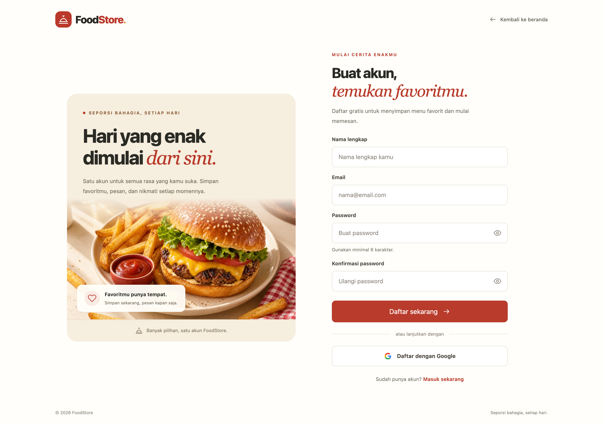

# Fullstack MERN Foodstore

A full-featured food e-commerce application built with the MERN Stack (MongoDB, Express, React, Node.js). Users can browse food products, add to cart, checkout with delivery address, pay via Midtrans, track order status in real-time via Pusher, confirm delivery, review purchased items, and save favourites to wishlist. Authentication supports email/password with email verification and Google OAuth. Admins can manage products, categories, and orders, and monitor a live dashboard with revenue charts, low-stock alerts, and Excel export. Ships with a mobile-ready REST API including Google Sign-In mobile endpoint and Expo push notifications for real-time order status updates (React Native / Flutter).

---

## Project Structure

```
fullstack-mern-foodstore/
├── foodstore-server/                  # Backend (Node.js + Express)
│   ├── app/
│   │   ├── auth/                      # Register, login, logout, me, Google OAuth
│   │   ├── cart/                      # Shopping cart
│   │   ├── cart-item/                 # Cart item model
│   │   ├── category/                  # Product categories
│   │   ├── dashboard/                 # Admin dashboard stats & charts
│   │   ├── delivery-address/          # Delivery addresses
│   │   ├── invoice/                   # Order invoices
│   │   ├── order/                     # Orders
│   │   ├── order-item/                # Order items
│   │   ├── payment/                   # Midtrans Snap payment gateway
│   │   ├── policy/                    # Role-based access control (CASL)
│   │   ├── product/                   # Food products
│   │   ├── review/                    # Product reviews & ratings
│   │   ├── tag/                       # Product tags
│   │   ├── user/                      # User model, set-password, avatar upload, FCM token
│   │   ├── upload/                    # General image upload to Cloudinary
│   │   ├── pusher-auth/               # Pusher private channel auth endpoint
│   │   ├── wilayah/                   # Indonesian regional data (CSV-based)
│   │   ├── wishlist/                  # Wishlist
│   │   ├── utils/
│   │   │   ├── cloudinary.js          # Cloudinary upload/delete helper
│   │   │   ├── expo-push.js           # Expo push notification sender
│   │   │   ├── firebase.js            # Firebase Admin SDK init (FCM fallback)
│   │   │   ├── logger.js              # API request/response logger middleware
│   │   │   ├── mailer.js              # Nodemailer transporter
│   │   │   └── get-token.js           # JWT token helper
│   │   └── config.js
│   ├── database/                      # MongoDB connection
│   └── app.js                         # Express entry point
│
└── foodstore-web/                     # Frontend (React)
    └── src/
        ├── api/                       # Axios API call layer
        │   ├── auth.js                # login, register, logout, getMe, setPassword
        │   ├── cart.js
        │   ├── category.js
        │   ├── dashboard.js
        │   ├── invoice.js
        │   ├── orders.js
        │   ├── payment.js
        │   ├── products.js
        │   ├── review.js
        │   ├── tag.js
        │   └── wishlist.js
        ├── app/                       # Redux store & middleware listener
        ├── component/                 # Reusable components
        │   ├── AppSidebar/            # Category & admin navigation
        │   ├── Cart/                  # Cart drawer
        │   ├── OnlyAdmin/             # Admin route guard
        │   ├── OnlyGuest/             # Guest route guard
        │   ├── OnlyLogin/             # Auth route guard
        │   ├── SelectWilayah/         # Indonesian region selector
        │   ├── SocketNotification/    # Pusher real-time notification panel (admin)
        │   ├── StarRating/            # Star rating display
        │   ├── StatusLabel/           # Payment status badge
        │   └── Topbar/                # Top navigation bar
        ├── features/                  # Redux slices
        │   ├── Auth/
        │   ├── Cart/
        │   ├── categories/
        │   └── products/
        ├── hooks/                     # Custom React hooks
        ├── pages/                     # Application pages
        │   ├── 404/
        │   ├── Account/               # Profile, order history, set password
        │   ├── AdminOrderDetail/      # Admin order detail page
        │   ├── AdminOrders/
        │   ├── AuthCallback/          # Google OAuth callback — reads token from URL
        │   ├── CekEmail/              # "Silakan cek email" prompt after register or unverified login
        │   ├── VerifyEmail/           # Process verification token from email link
        │   ├── Checkout/
        │   ├── Dashboard/
        │   ├── Home/
        │   ├── Login/                 # Email/password + Google login button
        │   ├── Register/
        │   ├── RegisterSucces/
        │   ├── UserAddressAdd/
        │   ├── Wishlist/
        │   ├── categories/
        │   ├── invoice/
        │   ├── logout/
        │   ├── product/
        │   ├── tag/
        │   └── userAddress/
        ├── styles/
        └── utils/
```
---

## Tech Stack

### Backend

| Package | Purpose |
|---------|---------|
| Node.js | JavaScript runtime |
| Express | HTTP framework, routing, middleware |
| MongoDB | NoSQL document database |
| Mongoose | ODM — schema, model, query builder |
| jsonwebtoken | JWT authentication & authorization |
| passport | Authentication middleware |
| passport-local | Local email/password strategy |
| passport-google-oauth20 | Google OAuth 2.0 strategy |
| bcrypt | Password hashing |
| cors | Cross-origin resource sharing |
| cookie-parser | Cookie parsing middleware |
| multer | Multipart/form-data (file uploads) |
| cloudinary | Cloud image storage & CDN |
| @casl/ability | Role-based access control |
| nodemailer | Transactional email (order confirmation) |
| midtrans-client | Midtrans Snap payment gateway |
| pusher | Trigger real-time events to clients via Pusher API |
| axios | HTTP client — used for Expo Push API calls |
| firebase-admin | Firebase Admin SDK — FCM push notification (optional, loaded from service account JSON) |
| google-auth-library | Verify Google `id_token` from mobile SDK for `POST /auth/google/mobile` |
| csvtojson | Parse Indonesian regional data from CSV |
| mongoose-sequence | Auto-increment customer_id |
| dotenv | Environment variable configuration |

### Frontend

| Package | Purpose |
|---------|---------|
| React.js | UI library |
| React Redux | Global state management |
| redux-thunk | Async middleware for Redux |
| Context API | Local/shared state without Redux |
| react-router-dom | Client-side routing |
| axios | HTTP client for API calls |
| TailwindCSS | Utility-first CSS framework |
| styled-components | Component-scoped CSS-in-JS |
| @emotion/react & @emotion/styled | CSS-in-JS for upkit components |
| upkit | UI component library (SideNav, LayoutSidebar, etc.) |
| react-hook-form | Form state & validation handling |
| formik | Form state management |
| yup | Validation schema |
| recharts | Chart library (dashboard revenue & orders) |
| react-data-table-component | Admin data tables with pagination |
| react-spinners | Loading indicators |
| pusher-js | Pusher client — subscribe to real-time events from Pusher |
| xlsx (SheetJS) | Client-side Excel file generation for order export |

---

## Coming soon

- Rekomendasi produk AI — integrasi OpenAI API
- monitoring Sentry — error tracking production, tau kalau ada crash di user
- **Device ID & One Account One Device** — setiap login menyimpan `device_id` (generated dari fingerprint perangkat) ke DB. Satu akun hanya boleh login di satu HP sekaligus. Jika login dari perangkat baru, sesi di perangkat lama otomatis dicabut. Backend menyimpan `{ token, device_id, last_active }` per sesi di array `sessions[]` dalam dokumen User.
  - **Enhanced:** `POST /auth/login` — tambah field `device_id` di body, simpan sesi baru, cabut sesi lama jika device berbeda
  - **Enhanced:** `POST /auth/logout` — invalidate hanya sesi device yang sedang aktif (bukan semua token)
  - **New API:** `GET /api/users/sessions` — list semua sesi aktif milik user `[{ device_id, last_active, current }]`
  - **New API:** `DELETE /api/users/sessions/:device_id` — paksa logout dari perangkat tertentu (remote logout)

- PWA (Progressive Web App)
- Jest + React Testing Library
- TanStack Query (React Query) — gantikan manual loading/error state, auto cache, refetch.
- Swagger / OpenAPI
- **Mode Kasir / POS (Point of Sale)**
- **Barcode Scanner** — extend product search, scan via kamera (ZXing) atau USB reader
- **Pembayaran Tunai** — extend payment page, tambah opsi "Tunai" di samping Midtrans, hitung kembalian otomatis
- **Order Source Flag** — tambah field `source: 'kasir' | 'online'` di Order model
- **Walk-in Customer** — transaksi tanpa akun, reuse guest flow
- **Struk Printer**
- **Barcode Produk**

## New Features

- **Midtrans Payment Gateway**
- **Admin Dashboard** — 30-day revenue chart, orders per day, top 5 best-selling products, summary cards
- **Admin Order Management** — admin updates order status from UI (processing → in_delivery → delivered)
- **Rating & Review**
- **Cloudinary Image Upload**
- **Order Confirmation Email**
- **Stock Management**
- **Pusher Real-time Notifications** — admin gets instant toast when payment settles, customer sees order status update live (Pusher used instead of Socket.io for Vercel serverless compatibility)

  ```
  [Order dibuat]
  order.status    = waiting_payment
  payment_status  = waiting_payment
  → 📧 Email ke user
          ↓
  [User bayar via Midtrans]
  payment_status  = settlement
  order.status    = processing  ← otomatis
  → 📡 Pusher: private-admin       (payment:settlement)
  → 📡 Pusher: private-order-{id}  (order:status_updated)
  → 🔔 FCM ke user (mobile)
          ↓
  [Admin update → in_delivery]
  → 📡 Pusher: private-order-{id}  (order:status_updated)
  → 🔔 FCM ke user (mobile)
          ↓
  [User/Admin konfirmasi → delivered]
  → 📡 Pusher: private-order-{id}  (order:status_updated)
  → 🔔 FCM ke user (mobile)
  ```

- **Google OAuth** — login with Google account via `passport-google-oauth20`. Smart account merge: if the Google email already exists in DB (registered via email/password), `google_id` is linked to the existing account — no duplicate accounts. New Google users are auto-registered without a password. Users can optionally set a password later from the Account page to enable both login methods on the same account.

- **Email Verification** — all new accounts (email/password or Google) must verify their email before logging in. A verification link is sent via Nodemailer and expires in 24 hours. If the link expires or login is attempted before verifying, a new link is automatically re-sent and the user is redirected to `/cek-email`.

- **Export Laporan Excel**

- **Google Sign-In Mobile** — `POST /auth/google/mobile` endpoint for Google login from Flutter / React Native apps. Mobile app sends the `id_token` from the Google SDK, backend verifies it via `google-auth-library`, runs the same account merge logic as the web OAuth flow, and returns `{ user, token }`. No browser redirect required.

- **Low Stock Alert**

## Features

- Product listing with search by keyword, category, and tags
- User registration & login (JWT-based auth + Google OAuth)
- Email verification before first login
- Shopping cart (per-user, isolated)
- Checkout with delivery address selection
- Midtrans Snap payment gateway (sandbox)
- Order history & invoice detail with visual timeline
- Real-time order status tracking via Pusher
- User can confirm delivery directly from invoice page
- Product rating & review (only after payment settled)
- Wishlist — save favourite products
- Manage delivery addresses with Indonesian regional data (province, city, district, village)
- Account page with collapsible pending-payment banner (user) / pending-orders banner (admin)
- Admin product, category & order management
- Admin dashboard — revenue chart, top products, summary cards
- Low-stock alert via Pusher when stock ≤ 5
- Export all orders to Excel (client-side, SheetJS)
- Role-based access control (guest / user / admin)

---

## Authentication Flow

### Register



```
User fills register form (full_name, email, password)
        │
        ▼
POST /auth/register
        │
        ├─► Email already exists            → error "Email already registered"
        │
        └─► Email not found
                │
                ▼
            Create user { verified: false }
            Hash password (bcrypt)
            Send verification link at email (Nodemailer)
            Return { message: "Register success" }
                │
                ▼
            Redirect to /cek-email
            (user must verify before login)
```

---

### Email / Password Login


```
User enters email + password
        │
        ▼
POST /auth/login
        │
        ├─► Email not found              → error "Email or password incorrect"
        │
        ├─► Wrong password              → error "Email or password incorrect"
        │
        ├─► Account not yet verified
        │       │
        │       ▼
        │   Resend verification link at email (Nodemailer)
        │   Redirect to /cek-email (flow Email Verification)
        │
        └─► Valid account & verified
                │
                ▼
            Generate JWT token
            Save token to DB (tokens[] array)
            Return { user, token }
                │
                ▼
            Frontend saves token to localStorage
            Redux dispatch userLogin
            Redirect to /
```

---

### Google OAuth Login

```
User clicks "Sign in with Google"
        │
        ▼
GET /auth/google  →  Redirect to Google Consent Screen
        │
        ▼ (user approves)
GET /auth/google/callback  (handled by passport-google-oauth20)
        │
        ├─► google_id found in DB
        │       → Login as existing account
        │
        ├─► Email found but no google_id
        │       → add obj google_id from res google to existing account (merge, no duplicate)
        │       → Login as existing account
        │
        └─► Email & google_id not found
                → Auto-register new user (no password)
                │
                ▼
        Check verified:
        ├─► Not Verified -> send email && Redirect to /cek-email (flow Email Verification)
        └─► Verified → generate token, redirect to:
                CLIENT_URL/#/auth/callback?token=<jwt>
                (auto redrect)
                │
                ▼
            Frontend reads token from URL params
            Save to localStorage
            Redux dispatch userLogin
            Redirect to /
```

---

### flow Email Verification

```
flow login/register/google (email/password or Google)
        │
        ▼
Send email with link:
  /verify-email?token=<uuid> (ui loading verifikation)
  (link valid for 24 hours)
        │
        ▼
User clicks link in email
        │
        ▼
GET /auth/verify-email/:token
        │
        ├─► Token invalid / expired  → error, prompt resend at /cek-email
        └─► Token valid
                │
                ▼
            Set verified: true in DB
            Remove verification token
            Return { message: "Account successfully verified" }
            /verify-email?token=<uuid> (ui succes verified)
            User can now login normally
```

---

### Cart

Users can select individual items via checkbox before checkout. The order summary panel on the right updates in real-time showing subtotal, shipping fee, and total. Only checked items are included in the purchase.

```
Cart page
        │
        ├─► Check/uncheck item          → subtotal recalculates
        ├─► Select all checkbox         → toggle all items
        ├─► +/- quantity buttons        → update qty, recalculate price
        ├─► Delete (trash icon)         → remove item from cart
        │
        └─► Click "Beli (n)"
                │
                ▼
            POST /api/orders (checked items only)
            Clear cart
            Redirect to /checkout
```

---

## Checkout

3-step checkout flow with a visual progress bar. Each step must be completed before proceeding.

```
Step 1 — Order Items
        │
        Review selected items, qty, and price
        │
        ▼
Click "Selanjutnya →"

Step 2 — Delivery Address
        │
        Choose from saved addresses (radio select)
        ├─► No address yet → click "+ Tambah Alamat" → /alamat-pengiriman/tambah
        │
        ▼
Click "Selanjutnya →"

Step 3 — Order Confirmation
        │
        Review: delivery address, items, subtotal, shipping fee, total
        │
        ▼
Click "🛒 Bayar Sekarang"
        │
        ▼
POST /api/orders
        ├─► Stock decremented automatically
        ├─► Cart cleared
        ├─► Invoice created (status: waiting_payment)
        └─► Order confirmation email sent via Nodemailer (fire-and-forget)
                │
                ▼
            Redirect to /invoice/:order_id
```

---

## Invoice & Payment

Full invoice lifecycle — from pending payment through each order status, with real-time updates via Pusher.

```
Invoice page loads (status: waiting_payment)
        │
        ▼
Status banner: ⏳ "Waiting Payments"
User clicks "🔒 Buy Now"
        │
        ▼
GET /api/payments/token/:order_id → snap_token
Midtrans Snap popup opens
        │
        ├─► User selects payment method
        │   (Credit card, GoPay, VA, QRIS, OVO, Dana, etc.)
        │
        ▼
Payment completed
        │
        ▼
onSuccess callback → verifyPayment()
GET /api/payments/verify/:order_id
        ├─► Sync payment status from Midtrans to DB
        └─► Pusher triggers admin toast notification
                │
                ▼
Invoice status updates (no reload needed)

━━━ Real-time Order Status (Pusher) ━━━

Admin updates order status from /admin/orders
        │
        ▼
PUT /api/orders/:id/status
        │
        ▼
Pusher event fired: order:status_updated
on channel: private-order-<id>
        │
        ▼
Invoice page receives event → status updates live

Status progression & banners:
  ✅  payment confirmed  → "Pembayaran Dikonfirmasi"
  🔄  processing        → "Pesanan Sedang Diproses"
  🚚  in_delivery       → "Pesanan Dalam Pengiriman" + ✓ Konfirmasi Diterima button
  🎉  delivered         → "Pesanan Berhasil Diterima!"
  ❌  failed/expired    → "Pembayaran Gagal"
```

> The **✓ Konfirmasi Diterima** button is shown to the user when the order is `in_delivery`. Clicking it calls `PUT /api/orders/:id/status { status: "delivered" }` — user can confirm receipt without going through admin.

---

## Admin Dashboard

Only accessible to users with `role: admin`. Non-admin users are redirected by the `OnlyAdmin` route guard.

```
Admin navigates to /admin/dashboard
        │
        ▼
OnlyAdmin guard checks Redux auth state
        ├─► Not admin → redirect to /
        └─► Admin → render Dashboard
                │
                ▼
        Component mounts
        Fire 3 API calls in parallel (Promise.all):
        │
        ├─► GET /api/dashboard/summary
        │       Aggregate Invoice (payment_status: settlement/paid/capture)
        │       Count Order, Product, User (role: user)
        │       → { total_revenue, total_orders, total_products, total_users }
        │
        ├─► GET /api/dashboard/revenue
        │       Aggregate Invoice last 30 days
        │       Group by date (%Y-%m-%d)
        │       → [{ _id: "2024-01-01", revenue: 150000, orders: 3 }]
        │
        └─► GET /api/dashboard/top-products
                Aggregate OrderItem, group by product
                Sort by total_qty DESC, limit 5
                Lookup products collection for name + image
                → [{ name, image_url, total_qty, total_revenue }]
                        │
                        ▼
                Loading state (BounceLoader) until all 3 resolve
                        │
                        ▼
                Render:
                ├─► 4 Summary Cards (Revenue, Orders, Produk, User)
                ├─► Area Chart — Revenue 30 Hari Terakhir (Recharts)
                ├─► Bar Chart  — Orders per Hari (Recharts, same chartData)
                └─► Top 5 Produk Terlaris (ranked list with image)
```
---

## Admin — Manage Produk
1. retrieve
```
Admin navigates to /admin/product
        │
        ▼
Component mounts — fire 3 parallel requests:
  ├─► GET /api/products?limit=10&skip=0   → product list (paginated, server-side)
  ├─► GET /api/categories?limit=100       → populate category dropdown in form
  └─► GET /api/tags?limit=100             → populate tag checkboxes in form

Backend (GET /api/products):
  Build criteria from query params (q, category, tags)
  Product.find(criteria).limit().skip().populate('category').populate('tags')
  Return { data: [...], count: <total> }
        │
        ▼
Render DataTable (react-data-table-component):
  Columns: Image · Name · Price · Category · Tags · Stock · Actions
  Pagination: server-side, 10 per page
        │
        ├─► Stock badge logic:
        │       stock === 0   → red badge "Habis"
        │       stock <= 5    → orange badge "⚠ {n}"
        │       stock > 5     → plain number
        │
        └─► Page change → setPage(n) → re-fetch with new skip
```
2. Create

```
Admin clicks "+ Tambah Produk"
        │
        ▼
Modal opens (selectedProduct = null)
Form fields: Name*, Description, Price*, Stock*, Category (dropdown), Tags (checkboxes), Image (file)
        │
        ▼
Admin fills form → clicks "Simpan"
        │
        ▼
handleSubmit:
  Build FormData (multipart/form-data)
  POST /api/products  (multer memoryStorage — no disk write)
        │
        ▼
Backend (store):
  CASL policy.can('create', 'Product') — admin only
  Resolve tags: Tag.find({ name: { $in: payload.tags } }) → replace names with ObjectId[]
  Resolve category: Category.findOne({ name: regex }) → replace name with ObjectId
  If image: uploadToCloudinary(req.file.buffer) → save secure_url
  new Product(payload).save()
  Return saved product
        │
        ▼
Frontend: close modal → re-fetch product list
```
3. Update

```
Admin clicks "Edit" on a row
        │
        ▼
Modal opens pre-filled with row data (selectedProduct = row)
Image field optional — leave blank to keep existing image
        │
        ▼
Admin edits fields → clicks "Update"
        │
        ▼
handleSubmit:
  Build FormData
  PUT /api/products/:id
        │
        ▼
Backend (update):
  CASL policy.can('update', 'Product') — admin only
  Same tag & category resolution as Create
  If new image file:
    deleteFromCloudinary(existing.image_url)   ← old image removed from cloud
    uploadToCloudinary(req.file.buffer)        ← new image uploaded
  Product.findOneAndUpdate({ _id }, payload, { new: true, runValidators: true })
  Return updated product
        │
        ▼
Frontend: close modal → re-fetch product list
```
4. Delete

```
Admin clicks "Delete" on a row
        │
        ▼
window.confirm('Yakin hapus produk ini?')
  ├─► Cancel → nothing
  └─► OK
        │
        ▼
DELETE /api/products/:id
        │
        ▼
Backend (destroy):
  CASL policy.can('delete', 'Product') — admin only
  Product.findOneAndDelete({ _id })
  Return { message, data }
        │
        ▼
Frontend: re-fetch product list
```
5. realtime notif stok lower and update stok if order by user

Stock is not decremented manually — it happens automatically at order creation:

```
POST /api/orders (customer checkout)
        │
        ▼
For each order item:
  Product.findOneAndUpdate(
    { _id: item.product },
    { $inc: { stock: -item.qty } },
    { new: true }
  )
        │
        ├─► updated.stock <= 5
        │       Pusher fires 'product:low_stock' on 'private-admin'
        │       Admin sees orange low-stock toast in real-time
        │
        └─► Stock badge on /admin/product updates on next fetch
```

---

## Admin — Manajemen Order

```
Admin navigates to /admin/orders
        │
        ▼
Component mounts — fire 2 parallel requests:
  ├─► GET /api/orders/stats
  │       Aggregate Order group by status
  │       → { total, by_status: { waiting_payment, processing, in_delivery, delivered, pending } }
  │       Used for: 4 stat cards + tab count badges
  │
  └─► GET /api/orders?limit=10&page=1
        Order.find().populate('order_items').populate('user').sort('-createdAt')
        → { data: [...], count }
        │
        ▼
Render:
  ├─► 4 Stat Cards (Total Order, Menunggu Bayar, Diproses/Dikirim, Diterima)
  ├─► Status Tabs (Semua · Menunggu Bayar · Diproses · Dikirim · Diterima · Pending)
  │       Tab click → setActiveTab + reset page → re-fetch with ?status=<key>
  │
  └─► DataTable — server-side pagination, 10 per page
        Columns: Order# · Tanggal · Customer · Items · Total · Status · Aksi
        Row click → navigate to /admin/orders/:id (order detail)
```

### Status Flow & Aksi Button

Status progression is one-way, defined in `STATUS_FLOW`:

```
waiting_payment  →  (no action — payment decides this transition)
processing       →  [→ Dikirim]   (next: in_delivery)
in_delivery      →  [→ Diterima]  (next: delivered)
delivered        →  —             (terminal)
pending          →  —             (terminal)
```

The "Aksi" column reads `STATUS_FLOW[row.status].next` — if `null`, shows `—`. Otherwise renders the `→ {nextLabel}` button.

### Update Status (Admin)

```
Admin clicks "→ Dikirim" or "→ Diterima"
        │
        ▼
handleUpdateStatus(order, newStatus):
  setUpdatingId(order._id)   ← disables button while in flight
  PUT /api/orders/:id/status  { status: newStatus }
        │
        ▼
Backend (updateStatus):
  req.user.role === 'admin'
  Allowed values: ['processing', 'in_delivery', 'delivered']
  Order.findByIdAndUpdate({ _id }, { status }, { new: true })
        │
        ▼
  pusher.trigger(`private-order-${order._id}`, 'order:status_updated', {
      order_id, status
  })
        │
        ▼
Frontend (AdminOrders):
  Optimistic update → setOrders(prev.map patch status in-place)
  Re-fetch stats → tab count badges update
```

### Real-time Update to Customer (Pusher)

```
Customer is on /invoice/:order_id page
        │
        ▼
useEffect on mount:
  pusher.subscribe(`private-order-${order_id}`)
  channel.bind('order:status_updated', ({ status }) => {
      setInvoice(prev => { ...prev, order: { ...prev.order, status } })
  })
        │
        ▼
When admin updates status (above):
  Pusher broadcasts 'order:status_updated' on that channel
        │
        ▼
Customer's invoice page receives event — status banner updates live:
  processing   → "🔄 Pesanan Sedang Diproses"
  in_delivery  → "🚚 Pesanan Dalam Pengiriman" + button "✓ Konfirmasi Diterima"
  delivered    → "🎉 Pesanan Berhasil Diterima!"

No page reload needed.

On unmount: channel.unbind_all() + pusher.unsubscribe(channel)
```

### User Self-Confirm Delivery

```
Customer clicks "✓ Konfirmasi Diterima" (only visible when status = in_delivery)
        │
        ▼
PUT /api/orders/:id/status  { status: 'delivered' }
        │
        ▼
Backend (updateStatus — user branch):
  status must be 'delivered'
  existing.user must match req.user._id    ← ownership check
  existing.status must be 'in_delivery'   ← guard against invalid transition
  Update → Pusher fires same 'order:status_updated' event
```

### Export Excel

```
Admin clicks "⬇ Export Excel"
        │
        ▼
GET /api/orders/export  (admin only, no pagination)
  Order.find().populate('order_items').populate('user').sort('-createdAt')
  → all orders
        │
        ▼
Client-side (SheetJS):
  Sheet 1 "Ringkasan Order" — one row per order
    (No. Order, Tanggal, Customer, Email, Jumlah Item, Sub Total, Ongkir, Total, Status, Alamat)
  Sheet 2 "Detail Items" — one row per product line
    (No. Order, Tanggal, Customer, Nama Produk, Qty, Harga Satuan, Subtotal)
  XLSX.writeFile → download laporan-order-{date}.xlsx
  No file generated on server.
```

---

## API Endpoints

Base URL: `http://localhost:3000`

> Auth endpoints are under `/auth`. All other endpoints are prefixed with `/api`.

---

### Auth

**`POST /auth/register`**
**Body (form-data)**
```json
{ "full_name": "string", "email": "string", "password": "string" }
```
**Response**
```json
{ "message": "Register success" }
```

**`POST /auth/login`**
**Body (form-data)**
```json
{ "email": "string", "password": "string" }
```
**Response**
```json
{ "user": { "_id": "", "full_name": "", "role": "user" }, "token": "<jwt>" }
```

**`GET /auth/me`**
Requires `Authorization: Bearer <token>`. Returns current logged-in user.

**`POST /auth/logout`**
Requires `Authorization: Bearer <token>`.

**`GET /auth/verify-email/:token`**
Verify email from link. Token must exist in DB and not be expired.

**Response**
```json
{ "message": "Akun berhasil diverifikasi" }
```
On failure:
```json
{ "error": 1, "message": "Link verifikasi tidak valid atau sudah expired" }
```

**`POST /auth/resend-verification`**
Resend verification email. Used on `/cek-email` page when user didn't receive the link.

**Body (form-data)**
```json
{ "email": "string" }
```
**Response**
```json
{ "message": "Link verifikasi telah dikirim ulang" }
```

---

**`GET /auth/google`**
Redirect browser to Google consent screen. No body needed — open directly in browser (not via axios).

**`GET /auth/google/callback`**
Google redirects here after user approves. Handled automatically by `passport-google-oauth20`.
Redirects to `CLIENT_URL/#/auth/callback?token=<jwt>` on success.

**Merge logic:**
- `google_id` found in DB → existing Google user, login directly
- Email found but no `google_id` → existing email/password account, link `google_id` to it
- Neither found → auto-register new user (no password)

**`POST /auth/google/mobile` — Mobile only (Flutter / React Native)**
Login Google dari aplikasi mobile. Mobile app mengirim `id_token` dari Google SDK — tidak pakai redirect browser.

**Body**
```json
{ "id_token": "<id_token dari Google SDK>" }
```
**Response sukses**
```json
{ "message": "logged in successfully", "user": { "_id": "", "full_name": "", "role": "user" }, "token": "<jwt>" }
```
**Response belum verifikasi email**
```json
{ "error": 1, "message": "email_not_verified", "email": "user@gmail.com" }
```

Merge logic sama persis seperti OAuth web. Cara pakai:
- **Flutter:** `google_sign_in` → `googleUser.authentication.idToken`
- **React Native:** `@react-native-google-signin/google-signin` → `GoogleSignin.signIn().idToken`

---

### User

**`PUT /api/users/set-password` — Login required**
Set or change password. Used by Google users who want to enable email/password login.

**Body**
```json
{ "password": "string", "password_confirmation": "string" }
```
**Response**
```json
{ "message": "Password berhasil disimpan" }
```

**`PUT /api/users/avatar` — Login required**
Upload user profile picture. Stored in Cloudinary (`foodstore/avatars`). Old image is automatically deleted.

**Body (form-data):** `image` (file, max 5MB)

**Response**
```json
{ "message": "Avatar berhasil diupdate", "image_url": "https://res.cloudinary.com/..." }
```

**`PUT /api/users/mobile/fcm-token` — Login required**
Save FCM token from mobile device. Used to send push notifications when order status changes.

**Body**
```json
{ "fcm_token": "string" }
```
**Response**
```json
{ "message": "FCM token tersimpan" }
```

---

### Upload — Login required

**`POST /api/upload`**
General-purpose image upload to Cloudinary (`foodstore/uploads`). For mobile apps that need to upload images outside of product/avatar flow.

**Body (form-data):** `image` (file, max 5MB)

**Response**
```json
{ "url": "https://res.cloudinary.com/...", "public_id": "foodstore/uploads/xxx", "width": 1080, "height": 720 }
```

---

### Product

**`GET /api/products`**
**Query params:** `limit`, `skip`, `q` (keyword), `category`, `tags[]`

**Response**
```json
{ "data": [ { "_id": "", "name": "", "price": 0, "image_url": "", "stock": 0 } ], "count": 0 }
```

**`POST /api/products` — Admin only**
**Body (form-data):** `name`, `description`, `price`, `category`, `tags[]`, `image` (file)

**Response:** created product object

**`PUT /api/products/:id` — Admin only**
Same fields as POST, all optional. Old image auto-deleted from Cloudinary on update.

**`DELETE /api/products/:id` — Admin only**
**Response**
```json
{ "message": "Product deleted" }
```

---

### Category

**`GET /api/categories`**
**Response**
```json
{ "data": [ { "_id": "", "name": "" } ], "count": 0 }
```

**`POST /api/categories`**
**Body:** `{ "name": "string" }`

**`PUT /api/categories/:id`**
**Body:** `{ "name": "string" }`

**`DELETE /api/categories/:id`**

---

### Tag

**`GET /api/tags`**
**`POST /api/tags` — **Body:** `{ "name": "string" }`**
**`PUT /api/tags/:id` — **Body:** `{ "name": "string" }`**
**`DELETE /api/tags/:id`**

---

### Delivery Address — Login required

**`GET /api/delivery-addresses`**
**Response**
```json
[ { "_id": "", "nama": "", "provinsi": "", "kabupaten": "", "kecamatan": "", "kelurahan": "", "detail": "" } ]
```

**`POST /api/delivery-addresses`**
**Body**
```json
{ "nama": "string", "provinsi": "string", "kabupaten": "string", "kecamatan": "string", "kelurahan": "string", "detail": "string" }
```

**`PUT /api/delivery-addresses/:id` — Owner only**
**`DELETE /api/delivery-addresses/:id` — Owner only**

---

### Cart — Login required

**`GET /api/carts`**
**Response**
```json
{ "items": [ { "_id": "", "product": {}, "qty": 1 } ] }
```

**`PUT /api/carts`**
**Body**
```json
{ "items": [ { "_id": "<product_id>", "qty": 2 } ] }
```

---

### Order — Login required

**`GET /api/orders`**
**Query params:** `limit`, `skip`, `status` (optional — filter by order status)

**Response**
```json
{ "data": [ { "_id": "", "status": "processing", "delivery_fee": 20000, "user": { "full_name": "", "email": "" }, "order_items": [], "createdAt": "" } ], "count": 0 }
```

**`GET /api/orders/stats` — Admin only**
Returns order counts grouped by status.

**Response**
```json
{ "total": 42, "by_status": { "waiting_payment": 5, "processing": 3, "in_delivery": 2, "delivered": 30, "pending": 2 } }
```

**`GET /api/orders/export` — Admin only**
Returns all orders (no pagination) with `user` and `order_items` populated. Used for client-side Excel generation.

**Response**
```json
{ "data": [ { "_id": "", "order_number": 1, "status": "", "delivery_fee": 0, "delivery_address": {}, "user": { "full_name": "", "email": "" }, "order_items": [ { "name": "", "qty": 1, "price": 0 } ], "createdAt": "" } ] }
```

**`POST /api/orders`**
Creates order from current cart. Decrements product stock automatically. Sends order confirmation email.

**Body**
```json
{ "delivery_fee": 20000, "delivery_address": "<address_id>" }
```
**Response:** created order object

**`GET /api/orders/:id`**
**Response:** single order object with `order_items`, `user`, and linked `invoice` (payment_status, total, sub_total).

**`PUT /api/orders/:id/status` — Login required**
**Body**
```json
{ "status": "processing | in_delivery | delivered" }
```
- **Admin** — can set any of the three statuses
- **User** — can only set `delivered` on their own order when current status is `in_delivery` (confirm receipt)

**Response:** updated order object. Also triggers a Pusher event `order:status_updated` on `private-order-<id>`.

---

### Invoice — Login required (owner only)

**`GET /api/invoices`**
Returns all invoices belonging to the logged-in user.

**Query params:** `limit`, `skip`

**Response**
```json
{ "data": [ { "_id": "", "order": {}, "payment_status": "waiting_payment", "total": 0, "createdAt": "" } ], "count": 0 }
```

**`GET /api/invoices/:order_id`**
**Response**
```json
{ "_id": "", "order": { "_id": "", "status": "", "order_items": [], "order_number": 0 }, "payment_status": "waiting_payment", "sub_total": 0, "delivery_fee": 0, "total": 0, "delivery_address": {}, "user": {} }
```

---

### Payment (Midtrans)

**`GET /api/payments/token/:order_id` — Login required**
Get Snap token to open Midtrans payment popup.

**Response**
```json
{ "token": "<snap_token>" }
```

**`GET /api/payments/verify/:order_id` — Login required**
Force-sync payment status from Midtrans API to database. Call this after payment popup closes.

**Response**
```json
{ "payment_status": "settlement | pending | deny | cancel | expire" }
```

**`POST /api/payments/notification`**
Midtrans webhook — called automatically by Midtrans server after payment event.

**Body (sent by Midtrans)**
```json
{ "order_id": "", "transaction_status": "settlement", "fraud_status": "accept" }
```

---

### Review

**`POST /api/reviews` — Login required**
**Body**
```json
{ "product_id": "", "order_id": "", "rating": 5, "comment": "string" }
```

**`GET /api/reviews`**
**Query params:** `product_id`, `order_id`

**Response**
```json
[ { "_id": "", "user": {}, "rating": 5, "comment": "", "createdAt": "" } ]
```

---

### Wishlist — Login required

**`GET /api/wishlists`**
**Response**
```json
[ { "_id": "", "product": { "_id": "", "name": "", "price": 0, "image_url": "" } } ]
```

**`POST /api/wishlists`**
**Body**
```json
{ "product_id": "<product_id>" }
```

**`DELETE /api/wishlists/:product_id`**

---

### Dashboard — Admin only

**`GET /api/dashboard/summary`**
**Response**
```json
{ "total_revenue": 0, "total_orders": 0, "total_products": 0, "total_users": 0 }
```

**`GET /api/dashboard/revenue`**
Revenue and orders per day, last 30 days.

**Response**
```json
[ { "date": "2024-01-01", "revenue": 150000, "orders": 3 } ]
```

**`GET /api/dashboard/top-products`**
Top 5 best-selling products.

**Response**
```json
[ { "product": { "name": "", "image_url": "" }, "total_qty": 20, "total_revenue": 300000 } ]
```

---

### Pusher Auth

**`POST /api/pusher/auth` — Login required**
Authenticate Pusher private channels. Called automatically by the Pusher JS client when subscribing to a `private-*` channel.

**Body**
```json
{ "socket_id": "string", "channel_name": "private-admin | private-order-<id>" }
```
**Response**
```json
{ "auth": "<pusher_signature>" }
```

Channels used:
- `private-admin` — admin receives payment settlement toasts and low-stock alerts
- `private-order-<id>` — customer receives real-time order status updates

---

### Wilayah (Indonesian Regional Data)

Data wilayah Indonesia dari file CSV. Filter menggunakan `kode_induk` (kode numerik dari level di atasnya).

**`GET /api/wilayah/provinsi`**
**Response**
```json
[ { "kode": "11", "nama": "ACEH" }, { "kode": "32", "nama": "JAWA BARAT" } ]
```

**`GET /api/wilayah/kabupaten?kode_induk=<kode_provinsi>`**
**Query params:** `kode_induk` — `kode` dari provinsi

**Example:** `GET /api/wilayah/kabupaten?kode_induk=32`
```json
[ { "kode": "3201", "kode_provinsi": "32", "nama": "KABUPATEN BOGOR" } ]
```

**`GET /api/wilayah/kecamatan?kode_induk=<kode_kabupaten>`**
**Query params:** `kode_induk` — `kode` dari kabupaten/kota

**Example:** `GET /api/wilayah/kecamatan?kode_induk=3201`
```json
[ { "kode": "3201010", "kode_kabupaten": "3201", "nama": "CIOMAS" } ]
```

**`GET /api/wilayah/desa?kode_induk=<kode_kecamatan>`**
**Query params:** `kode_induk` — `kode` dari kecamatan

**Example:** `GET /api/wilayah/desa?kode_induk=3201010`
```json
[ { "kode": "3201010001", "kode_kecamatan": "3201010", "nama": "MEKARJAYA" } ]
```

---

## Getting Started

> **Node.js >= 20** is required (for `firebase-admin` and `expo-server-sdk` compatibility). Use `nvm use 20` or higher.

### Backend

```bash
cd foodstore-server
npm install
# Create .env file (see Environment Variables below)
# Optional: place firebase-service-account.json in foodstore-server/ to enable FCM push notifications
npm run dev   # development (nodemon)
# or
npm start     # production
```

Server runs at `http://localhost:3000`

### Frontend

```bash
cd foodstore-web
npm install
# Create .env file (see Environment Variables below)
npm start
```

Frontend runs at `http://localhost:3001`

---

## Environment Variables

### `foodstore-server/.env`

```
PORT=3000
MONGODB_URI=mongodb+srv://<user>:<pass>@cluster.mongodb.net/foodstore
SECRET_KEY=your_secret_key

# Cloudinary
CLOUDINARY_CLOUD_NAME=
CLOUDINARY_API_KEY=
CLOUDINARY_API_SECRET=

# Nodemailer (Gmail App Password)
MAIL_USER=
MAIL_PASS=

# Midtrans (Sandbox)
MIDTRANS_SERVER_KEY=
MIDTRANS_CLIENT_KEY=
MIDTRANS_IS_PRODUCTION=false

# Pusher
PUSHER_APP_ID=
PUSHER_KEY=
PUSHER_SECRET=
PUSHER_CLUSTER=

# Google OAuth (web + mobile id_token verification)
GOOGLE_CLIENT_ID=
GOOGLE_CLIENT_SECRET=
GOOGLE_CALLBACK_URL=http://localhost:3000/auth/google/callback
CLIENT_URL=http://localhost:3001
```

> **FCM Push Notifications (optional):** Download the Firebase service account JSON from Firebase Console → Project Settings → Service Accounts → Generate new private key. Rename it to `firebase-service-account.json` and place it in `foodstore-server/`. The server auto-detects the file — if absent, push notifications are silently disabled.

### `foodstore-web/.env`

```
REACT_APP_API_HOST=http://localhost:3000
REACT_APP_SITE_TITLE=FoodStore
REACT_APP_GLOBAL_ONGKIR=20000
REACT_APP_OWNER=YourName
REACT_APP_CONTACT=your@email.com
REACT_APP_BILLING_NO=1234567890
REACT_APP_BILLING_BANK=BCA
REACT_APP_PUSHER_KEY=
REACT_APP_PUSHER_CLUSTER=
```

---

## Roles & Permissions (CASL)

| Role  | Access |
|-------|--------|
| guest | Read products |
| user  | CRUD own delivery addresses, update cart, create & view orders, read own invoices, manage wishlist, confirm own delivery |
| admin | Manage all resources (full access) |

---
